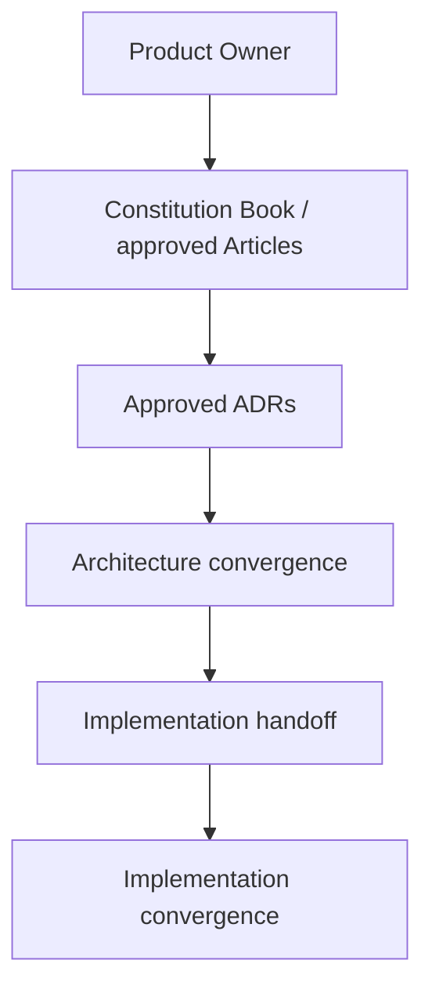
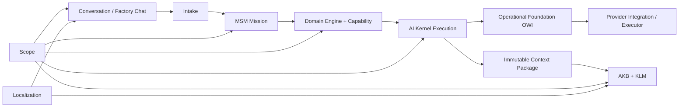
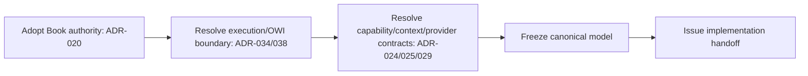
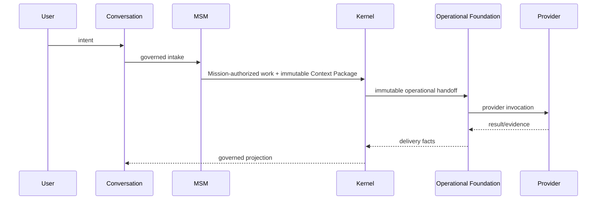

# AI Bridge Architecture Convergence Program - Master Plan

## 1. Executive summary

This is the controlled plan to converge AI Bridge's target architecture before implementation convergence. It authorizes no runtime, schema, migration, provider, or UI change. It consolidates authoritative target entries, exposes unresolved boundaries, and supplies a Product Owner (PO) decision sequence and implementation handoff.

## 2. Program charter and 3. Governance model

The question is **what AI Bridge SHALL be**, not how existing code is refactored. The governing hierarchy is the [Bridge Constitution](../constitution/BRIDGE_CONSTITUTION.md), [architecture/implementation governance](ARCHITECTURE_IMPLEMENTATION_CONVERGENCE_GOVERNANCE.md), approved target Articles, then approved ADRs. Repetition is not approval. This plan is proposed; it cannot amend a Constitution or approve an ADR.

## 4. Authoritative baseline

The Constitution is transitional canonical governance; the target Book remains more specific until formally adopted. Approved targets include Scope, Localization, AKB, AI Kernel, and implementation-convergence governance. The Runtime 2.0 epic and historical Phase 2/2.5 assessments are evidence and planning inputs, not substitute authority. The complete disposition is in the [decision register](architecture-convergence-program-master-plan/ARCHITECTURE_DECISION_STATUS_REGISTER.md).

## 5. Corpus assessment and 6. Decision-status method

The inventory uses `APPROVED`, `PROPOSED`, `OPEN`, `CHALLENGED`, `SUPERSEDED`, `HISTORICAL`, and `IMPLEMENTATION-ONLY`; a document may be mixed, with a status per decision. Historical evidence is retained and never silently promoted. See the [corpus and concept register](architecture-convergence-program-master-plan/ARCHITECTURE_CORPUS_AND_CONCEPT_REGISTER.md).

## 7. Canonical concept inventory

| Concept | Target rule | Current status |
| --- | --- | --- |
| Factory Chat UI | Conversation ingress/projection, not Runtime | APPROVED target direction |
| Conversation | First-class domain interaction | APPROVED target direction |
| Mission / MSM | Mission lifecycle belongs only to MSM, after intake | APPROVED target direction |
| Operational Foundation | Queue, lease, retry, recovery and handoff mechanics only | TRANSITIONAL target; boundary challenged |
| Engine / Capability / Provider | Engine owns domain capability; Provider is integration/executor, not a domain owner | APPROVED target direction |
| Context Package | Immutable, version-addressable selection boundary | APPROVED target direction |
| Scope | Organization -> Workspace -> Project; exactly one direct owner for every persistent object | APPROVED |
| Localization | English technical identifiers; eligible content multilingual; Evidence source preserved | APPROVED |

## 8. Conflicts and gaps

The critical conflicts are `Execution` versus `ExecutionRun`/`ExecutionJob`, legacy Provider Gateway terminology, legacy repository-as-scope wording, and entry/document-centred knowledge models. They are not implementation tasks in this program. The [conflict register](architecture-convergence-program-master-plan/ARCHITECTURE_DECISION_STATUS_REGISTER.md#conflicts-and-challenges) states the required challenge and decision.

## 9. Domain map and 10. dependency graph

## 11. Critical path and 12. workstreams

| Workstream | Outcome | Depends on |
| --- | --- | --- |
| W1 Constitution Book | adopted authority and amendment process | ADR-020 |
| W2 Runtime and Kernel | intake, Mission, Execution/OWI ownership | ADR-022, 023, 027, 033, 034, 038 |
| W3 Capability and Provider | capability contract, resolver/binding/recovery | ADR-024, 029 |
| W4 Knowledge and Context | object/lifecycle/reference/context contract | ADR-025, 030-032, 036 |
| W5 Scope and Localization | inheritance/sharing and representation mechanics | ADR-035, 037 |
| W6 Terminology and handoff | frozen glossary, diagrams, implementation package | W1-W5 |

## 13. Dependency and 14. staged plan

Stage 0: classify corpus and preserve evidence (complete with this plan). Stage 1: PO adopts Book authority and resolves execution ownership. Stage 2: PO resolves the dependent provider, capability, Context Package, and AKB contracts. Stage 3: resolve Scope/localization mechanics and run cross-domain challenges. Stage 4: freeze target architecture and issue a separate implementation contract.

## 15. Parallelization strategy

W3, W4, and W5 may prepare decision packs in parallel after W1, but none may publish contradictory terminology. W2 is the critical path. W6 is continuous for terminology and final only after every material decision is settled.

## 16. Challenge gates and 17. PO decision gates

Every challenge must show target rule, repository evidence, alternatives, owner, ADR, and explicit disposition. A contradiction, duplicate lifecycle owner, mutable Context Package, multi-owner persistent object, or source-Evidence overwrite fails the gate.

PO Gate A: ADR-020 Book adoption. Gate B: ADR-034/038 execution and OWI. Gate C: ADR-024/025/029 capability, context and provider. Gate D: ADR-030-032/036 AKB. Gate E: ADR-035/037 implementation mechanics. The queue is in the [decision register](architecture-convergence-program-master-plan/ARCHITECTURE_DECISION_STATUS_REGISTER.md).

## 18. Cross-cutting concerns

Scope, authorization, audit/Evidence, security, localization, failure recovery, replay/event semantics, immutable contracts, terminology, and migration safety are mandatory review dimensions for every ADR.

## 19. End-to-end target validation

## 20. Constitution consolidation and 21. terminology freeze

Adopt only a Book whose Articles name owners, invariants, boundaries, and ADR links. Freeze a single glossary after Gate E: `Mission` is not delivery work; `Execution` is not a provider attempt; logical `Workspace` is not physical execution workspace; Repository is a Resource; Provider Gateway is legacy adapter terminology, not a canonical domain. Historical artifacts receive a durable classification rather than edits that erase provenance.

## 22. Implementation-convergence handoff

No implementation Sprint may start from this plan alone. It needs the frozen architecture package, explicit approved ADR set, baseline assessment, migration/rollback strategy, acceptance matrix, and exact scope. See the [handoff contract](architecture-convergence-program-master-plan/IMPLEMENTATION_CONVERGENCE_HANDOFF_CONTRACT.md).

## 23. Risks, 24. open questions, and 25. next action

Primary risks are false approval inference, target/current conflation, duplicate execution ownership, and implementation beginning before freeze. Open questions are the execution/OWI relation; Context Package and Knowledge Reference contract; capability semantics; provider recovery; Scope inheritance/sharing; and language representation/fallback. **Next action:** PO reviews Gate A and Gate B decision packs; architecture owners then update only the approved canonical artifacts and this plan's registers.

ARCHITECTURE CONVERGENCE PROGRAM PLAN COMPLETE — READY FOR PRODUCT OWNER REVIEW
