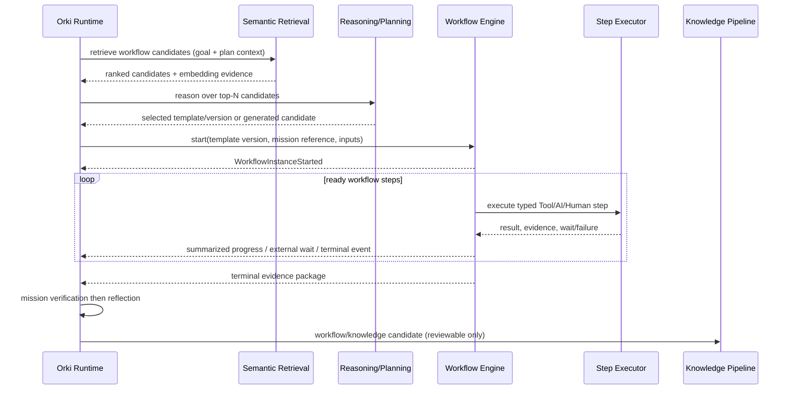
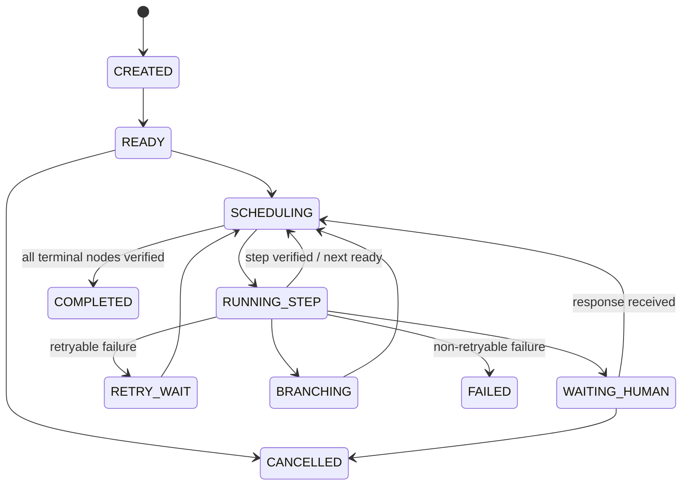

# Canonical Workflow Engine Architecture

## Canonical flow



The canonical mission pipeline is:

```text
Goal → Semantic Selection → Reasoning → Planning → Workflow Retrieval
→ Workflow Engine → Workflow State Machine → Workflow Steps → Verification
→ Reflection → Knowledge Integration
```

## Bounded contexts and ownership

| Context | Owns | Does not own |
| --- | --- | --- |
| Orki Runtime | Goal, mission plan, OESM mission lifecycle, mission events/progress, final verification, reflection, knowledge-candidate hand-off | Workflow-step scheduling/execution, template mutation, provider transport lifecycle |
| Workflow Engine | Template version resolution, `WorkflowInstance`, step state machine, step events/results, retries/branches/loops, human/tool/AI step dispatch | Mission approval, AKB activation, final mission reflection |
| Step executors | One typed action and normalized result/evidence | Workflow state, mission state |
| ExecutionRun / ExecutionJob | Existing governed provider execution/queue/recovery | Generic workflow orchestration |
| Knowledge Pipeline | Candidate validation, review, approval, active knowledge and vector indexing | Runtime execution or unreviewed template activation |

## Proposed durable model

These are target names, not models created by this assessment.

| Record | Essential fields | Invariants |
| --- | --- | --- |
| `WorkflowTemplate` | stable key, semantic version, schema, status, content hash, provenance | Approved versions are immutable; a new version never changes a running instance. |
| `WorkflowInstance` | template/version reference, `OrkiExecution` reference, inputs, state, state version, correlation id | One instance has one engine FSM; Runtime reference is external ownership only. |
| `WorkflowStepRun` | instance, node id, attempt, state, executor kind, input/output/evidence refs | Append-only attempt history; no direct mutation to terminal attempt. |
| `WorkflowEvent` | instance, sequence, event type, payload, evidence refs | Ordered, append-only; produces Runtime summaries, not duplicated state authority. |
| `WorkflowSelectionRecord` | query/context hash, top-N evidence, reasoning result, chosen version or no-match | Separates retrieval ranking from LLM/business selection and makes the choice auditable. |

## Workflow FSM



This FSM is intentionally distinct from OESM.  A mission can be `RUNNING` while an
instance is `WAITING_HUMAN`, and Runtime aggregates that event into its
`WAITING_EXTERNAL` projection without acquiring step ownership.

## Executor adapter contract

An Engine dispatches an explicit executor kind: `TOOL`, `AI`, `HUMAN`, or
`SUBWORKFLOW`.  Each adapter must accept idempotency/correlation keys and return a
normalized result:

```text
StepResult = { outcome, output_reference, evidence_references,
               retryable, wait_descriptor?, verification? }
```

The AI executor delegates governed coding/delivery work to the established
`ExecutionRun`/`ExecutionJob` path.  It never places provider credentials or provider
selection in Runtime.  A temporary `CallableExecutor` can adapt the current
`execute_shadow_operation` test seam, allowing existing real-file E2Es to remain
meaningful while ownership moves.

## Workflow retrieval and learning

Workflow retrieval uses existing semantic components, but filters to approved,
versioned workflow-template documents:

```text
Embedding → DjangoVectorStore search → top N candidates/evidence
→ reasoning over candidates → explicit selection record → Engine start
```

`SemanticCandidateSelector` ranks only and must not make the selection.  Reuse
`KnowledgePipelineService.retrieve_context` (or a small typed equivalent) to persist
the retrieval query, candidate versions and embedding evidence.  Do not index a
mutable `WorkflowInstance` or an unreviewed candidate.

Learning is a governed loop:

```text
mission plan → generated workflow candidate → execution evidence → verification
→ reflection → workflow candidate → review → approved template/version → index
```

The candidate is produced after Runtime reflection, contains template schema plus
evidence/provenance and is reviewable through the existing Knowledge Pipeline policy.
Only an approved immutable template version becomes retrievable.  This preserves the
existing rule that Runtime cannot directly activate AKB/vector knowledge.

## Foundation implementation status — 2026-08-09

The `Workflow Engine Foundation & Task Model` Sprint implements the bounded-context
foundation in `projects/workflow_engine.py` and additive `projects` persistence
models. `WorkflowInstance`, `WorkflowStep`, `Task`, `WorkflowEvent`,
`WorkflowSelectionRecord`, `WorkflowTemplate`, and `WorkflowCandidate` are now
separate from `OrkiExecution`, `ExecutionRun`, provider configuration, and
governance/approval records.

The implemented WSM is `CREATED -> READY -> RUNNING_STEP`, with durable
`WAITING`, `RETRY`, `COMPLETED`, `FAILED`, and `CANCELLED` outcomes. A completed
step can leave the instance `READY` when another explicit Task is scheduled; the
final Task completes the instance. Task retry count, maximum retry count, timeout,
input, output, evidence, and status are Engine-owned.

The Runtime's existing shadow-operation, structured-decision, and Factory Chat
provider paths now call this Engine through narrow adapters. Runtime retains mission
transitions, verification, reflection, and candidate creation; the Engine does not
import `orki_runtime` or mutate OESM. Existing `ExecutionRun` references are carried
by a Task where present, not replaced.

Selection persists vector top-N evidence and a reasoning record. It may select only
an explicitly `APPROVED` immutable `WorkflowTemplate`; missing or unapproved
templates fall back to the Runtime adapter workflow. Reflection creates a
review-only `WorkflowCandidate`; it neither activates nor embeds that candidate.
