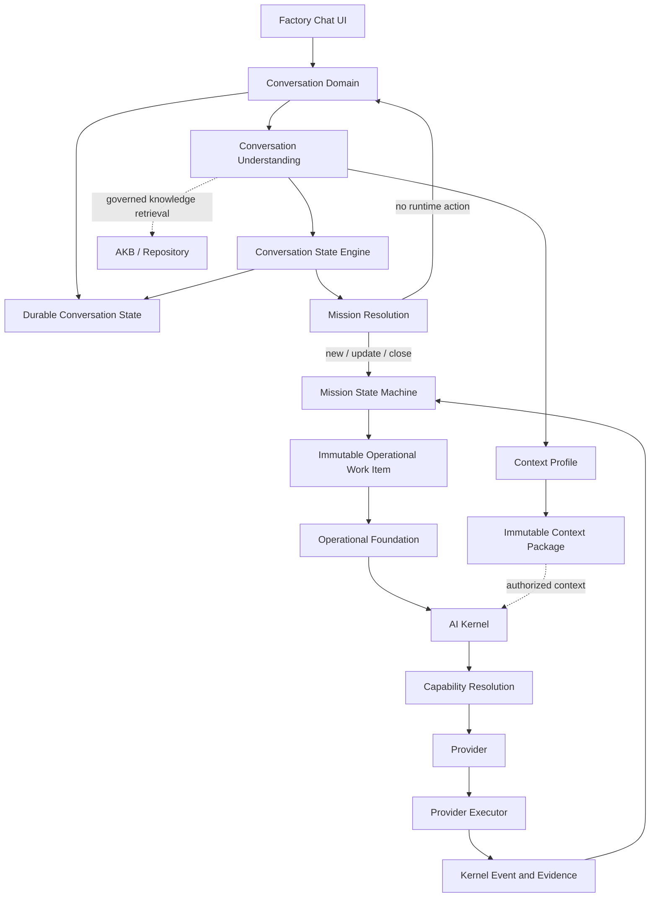

# Article IV - Conversation to Mission Architecture

## Status and authority

This is an approved target Constitution Book entry. It records the Product
Owner decision that human interaction is understood and governed in the
Conversation Domain before it can become a Mission. It does not assert that
the current repository implements this route, rename existing symbols, or
authorize a Runtime, data-model, API, or UI change.

This Article complements, and does not weaken, the Mission State Machine
(MSM) as the sole owner of Mission lifecycle state, the Operational Foundation
as the delivery boundary, and the AI Kernel as the technical execution core.

## 4.1 Purpose and boundary

The Conversation to Mission Architecture separates human understanding from
business execution. A human starts in Conversation; a Mission is created only
when the Conversation Domain has resolved that a governed runtime action is
required. API, MCP, Scheduler, Webhook, and Automation do not require a
Conversation, but SHALL converge on the same Mission-intake semantics.

The Mission is the first business object that can enter the operational
runtime path. The AI Kernel begins only after an MSM-authorized immutable
Operational Work Item has been admitted through the Operational Foundation.

```text
Human -> Factory Chat UI -> Conversation Domain -> Conversation Understanding
      -> Conversation State Engine -> Mission Resolution -> Mission -> MSM
                                                              |
                                                              v
                 immutable Operational Work Item -> Operational Foundation
                                                              |
                                                              v
                                                          AI Kernel
```

## 4.2 Factory Chat UI

Factory Chat is a localized presentation and interaction adapter. It MAY show
messages, attachments, streaming output, approvals, status, and projections.
It SHALL NOT own business state, create a Mission directly, start a Workflow,
invoke an Engine or Provider, or bypass a declared domain boundary.

The UI can request a Conversation action and display its attributable result;
it is never a second control path or a state-machine writer.

## 4.3 Conversation Domain

The Conversation Domain owns the durable human interaction record: messages,
attachments, ordered history, participant and Persona references, and its
conversation-specific metadata and state. It is not an AI Kernel component and
does not own Mission, Execution, Provider, or Operational Foundation state.

A transcript is not durable organizational knowledge. Decisions, accepted
knowledge, architecture records, Evidence, and Repository artifacts become
durable knowledge only through their respective governed publication paths.

## 4.4 Conversation Understanding

After each accepted human message, the Conversation Domain SHALL perform
Conversation Understanding sufficient to classify intent, identify or refine
the goal, assemble relevant context, and determine whether a Mission decision
is needed. The understanding capability includes:

- Intent detection and goal detection.
- Context building.
- Conversation and prior-Mission search.
- AKB, Repository, and semantic retrieval.
- Evidence-aware LLM analysis where policy permits.

Conversation Understanding is a stateless service capability. Its context
selection SHALL be adaptive and constrained by the declared Context Profile,
the requested purpose and capability, scope, and retrieval policy; there is no
universal mandatory retrieval sequence. A source that is absent, unauthorized,
or unavailable MUST be recorded in the resulting provenance and Evidence; it
MUST NOT be silently substituted with an assertion. The LLM is an analytical
capability, not a lifecycle owner or authority.

## 4.5 Conversation State Engine

The Conversation State Engine (CSE) is a stateless service boundary that
applies validated, attributable, versioned, evidence-linked transitions to the
durable Conversation State. It determines missing information, alternatives,
decision points, appropriate proactive prompts, and whether to request Mission
Resolution. It remains outside the AI Kernel and Operational Foundation.

Conversation State records three independent axes: semantic state
(`EXPLORING`, `DESIGNING`, `PROPOSAL_READY`, `DECISION_PENDING`, `DECIDED`),
lifecycle state (`ACTIVE`, `DEFERRED`, `CLOSED`, `REJECTED`), and readiness
facts. There is no numeric maturity score, technical `FAILED` conversation
state, or fixed universal progression: evidence may justify a transition on one
axis without changing the others. The CSE SHALL NOT write Mission, Execution,
Provider, Engine, Context Package, AKB, or Operational Work Item state.

## 4.6 Mission Resolution

Mission Resolution is the exclusive boundary between the Conversation Domain
and Mission intake. It evaluates whether the current outcome requires a new
Mission, an update to an existing Mission, closure of a Mission, or no runtime
action. No other Conversation component, UI adapter, Persona, Engine, Provider,
or LLM may create a Mission directly.

Mission Resolution is the only component permitted to originate a Mission
creation decision. The MSM remains the sole Mission lifecycle authority: it
validates and records the resulting Mission in its initial state, or rejects
the decision under policy. This separation gives Mission Resolution exclusive
intake authority without creating a second Mission state-machine writer.

```text
Mission Resolution
  -> New Mission | Existing Mission update | Mission closure | No runtime action
  -> MSM validation and lifecycle transition
```

## 4.7 Mission, MSM, and operational handoff

A Mission has immutable identity and includes its goal, scope, priority,
owner, metadata, current state, correlation, and evidence references. The MSM
exclusively owns its lifecycle. Neither CSE nor Mission Resolution can advance
a Mission after intake has been accepted.

The only canonical execution route is:

```text
Mission -> MSM -> immutable MSM-authorized Operational Work Item
-> Operational Foundation -> AI Kernel -> Capability / Provider execution
```

The MSM SHALL NOT invoke an Engine, Provider, Provider Executor, or Workflow
directly. The Operational Foundation SHALL NOT reinterpret business intent or
change Mission state. Capability Engines and Providers remain execution
participants, never Mission or Conversation authorities.

## 4.8 Context, knowledge, and proactivity

Conversation Understanding may resolve a Context Profile that declares the
persona or role, purpose, capability, scope, policy, and inputs used for a
request. It may then compose a Context Package according to the Context
Package contract. A Context Package is immutable, versioned, reproducible,
evidence-based, auditable, and provenance-linked to its Context Profile.
Runtime execution SHALL consume AKB and Repository knowledge only through an
authorized Context Package; it does not receive an uncontrolled transcript or
direct knowledge mutation path. Knowledge publication is a separate governed
path; a transcript or temporary context does not become knowledge by use.

Orki and other Personas MAY proactively identify missing information, risks,
alternatives, or decision points and propose the next Conversation action.
They SHALL NOT create a Mission, alter CSE or MSM state, or claim Product Owner
authority. A proactive recommendation becomes a Mission only through Mission
Resolution and MSM validation.

## 4.9 Evidence and auditability

Every significant Conversation state transition, Mission Resolution decision,
Mission intake outcome, and resulting operational handoff SHALL have durable,
attributable Evidence with correlation and provenance. The evidence SHALL make
it possible to reconstruct why a Mission was created, changed, closed, or not
created, without treating provider output as authority.

## 4.10 Invariants

1. A UI SHALL NOT create a Mission or start runtime work directly.
2. Conversation SHALL NOT call an Engine, Provider, Provider Executor, or AI
   Kernel directly.
3. The durable Conversation State exclusively records Conversation state; CSE
   applies its validated transitions and SHALL NOT write another domain's state.
4. Mission Resolution exclusively originates a Mission creation decision for a
   human Conversation.
5. MSM exclusively owns Mission lifecycle state, including accepting or
   rejecting an intake decision.
6. Operational work exists only as an immutable MSM-authorized Operational
   Work Item and crosses the Operational Foundation boundary.
7. AI Kernel execution starts only after the Operational Foundation admits
   authorized work.
8. Engines, Providers, and Provider Executors SHALL NOT become Mission or
   Conversation authorities.
9. Context Profiles and Context Packages record their policy and provenance;
   Context Packages are immutable and stale knowledge use requires explicit
   policy and evidence.
10. Conversation transcript, temporary context, sessions, requests, and
    runtime variables are not AKB Knowledge Objects.
11. Product Owner decisions are requested only for genuine business decisions;
    technical and lifecycle failures follow their owning recovery policy.
12. All significant boundary crossings and state transitions are auditable.

## 4.11 Target architecture diagram

The editable canonical visual companion is [Diagram 01 - Conversation
Layer](diagrams/01-conversation-layer/README.md). It depicts this Article's
logical boundary only; the Mermaid view below remains a text-based companion.



## Controlled convergence

This Article is a target architecture amendment. It requires a later approved
implementation contract before changing code, schemas, APIs, state records,
workflow routing, Provider routing, or Factory Chat behavior. Existing
Conversation, Factory Chat, Runtime, and Orki artifacts retain their stated
historical or transitional classification until implementation evidence proves
their replacement.
