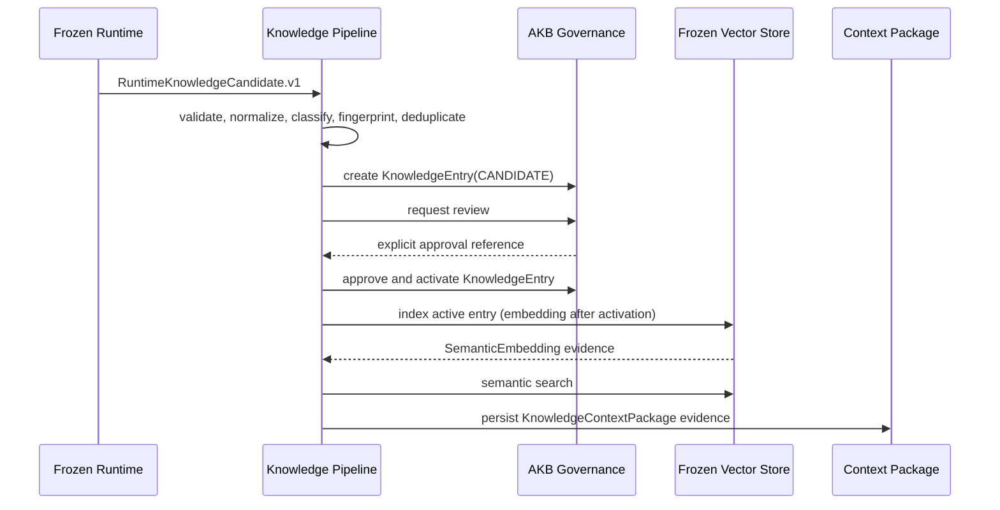

# Knowledge Pipeline and AKB Evolution

## Status

Sprint 06 implements the first independent Knowledge Pipeline. It is a
downstream consumer of the immutable `RuntimeKnowledgeCandidate.v1` contract;
it does not change Runtime, Reasoning, Structured Decision, Provider Gateway,
or the Semantic Layer.

## Canonical ownership boundary

```text
RuntimeKnowledgeCandidate.v1
    -> Knowledge Pipeline
    -> governed KnowledgeEntry
    -> approved active knowledge
    -> embedding and vector index
    -> semantic retrieval evidence
    -> KnowledgeContextPackage
```

The pipeline owns validation, normalization, declared-type classification,
content-fingerprint deduplication and durable processing receipts. It does not
make a business decision: review, approval and rejection are explicit caller
instructions, and activation remains governed by the existing AKB
`akb.review_candidate` approval action.

## Promotion and indexing sequence



The ordering is mandatory: candidate creation and review precede activation;
activation precedes embedding generation and vector indexing. An embedding
failure rolls back the enclosing promotion transaction. Retrieval is semantic
ranking only and returns evidence-bearing candidates; it does not make a
decision or format LLM context.

## Durable contract

`KnowledgePipelineReceipt` is a one-to-one, project-scoped record for the
Runtime candidate. It holds the normalized payload, SHA-256 fingerprint,
classification, linked `KnowledgeEntry` and optional `SemanticEmbedding`, as
well as append-only audit events. Reprocessing a terminal, review, or duplicate
receipt is idempotent. Equivalent candidates use the fingerprint to reference
the first entry rather than create another one.

The receipt states are `VALIDATED`, `IN_REVIEW`, `PROMOTED`, `REJECTED`, and
`DUPLICATE`. The existing `KnowledgeEntry` and `KnowledgeRevision` models remain
the authoritative AKB lifecycle and provenance records; the receipt is pipeline
evidence, not a second knowledge lifecycle.

## Migration and recovery

Migration `0062_sprint_06_knowledge_pipeline` adds only the receipt table and
foreign keys. It has no data backfill and leaves all existing AKB entries,
embeddings, Runtime behavior and `runtime_knowledge_compat.py` unchanged. The
standard migration rollback removes only this new receipt schema. Transactional
promotion prevents a partially promoted/indexed entry when indexing fails;
subsequent calls safely resume from the receipt state.

## Retrieval boundary

`KnowledgePipeline.retrieve_context` uses the existing `DjangoVectorStore`
public contract against active, project-scoped entries. It stores the result as
a `KnowledgeContextPackage` with query, scored candidates, metadata and
embedding evidence. This is a durable retrieval artifact for the next semantic
or reasoning consumer, not a Runtime action and not an LLM context formatter.
