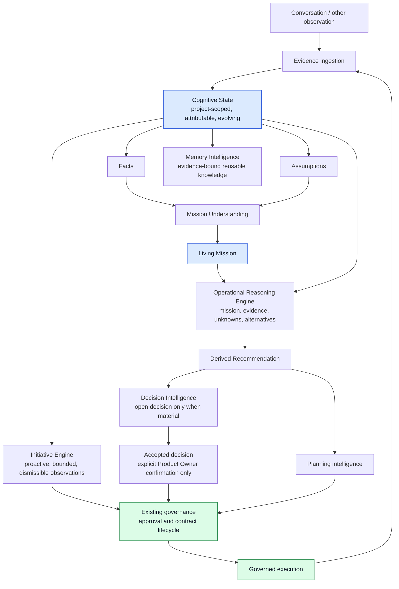

# Orki Cognitive Data Flow

**Status:** Canonical developer architecture contract
**Authority:** [Orki Principles](ORKI_PRINCIPLES.md), principles 2, 3, 8, 15, 16, 17, and 19.

## Purpose

This diagram is the mandatory path from a Product Owner interaction to a
governed execution. It prevents transcript-driven shortcuts: a consumer may
use a conversation as source evidence, but it must not treat it as memory,
mission, recommendation, plan, approval, or execution authority.

## Non-negotiable flow rules

1. An interface records an observation and its evidence; it does not create a
   canonical mission or plan merely by persisting transcript text.
2. Every material cognitive capability reads the project-scoped Cognitive
   State projection, never raw `FactoryChatMessage` rows as its working memory.
3. The Mission Understanding capability may derive an attributable proposed
   Mission from facts, explicit assumptions, and unknowns. It must not turn a
   provider response into accepted business intent.
4. The Operational Reasoning Engine, derived Recommendation, Decision,
   Planning, and Memory Engines are consumers of Mission and Cognitive State.
   Operational Reasoning retains evidence and assumption links, unknowns, at
   least three alternatives, trade-offs, counter-arguments, cost, risk,
   long-term effect, simplicity, expected impact, confidence, and its decision
   boundary. A Factory Chat/provider response cannot write a direct
   recommendation: only a validated reasoning artefact may derive one.
   Decision Intelligence may open a material decision, but only an explicit,
   attributable Product Owner confirmation can create an accepted decision.
   Planning Intelligence creates only an evidence-bound Cognitive Plan with
   revision history; it is not the legacy delivery-plan workflow. None of these
   engines may create a governance action or execution.
   Memory Intelligence creates evidence-bound, project-scoped reusable knowledge
   and retrieves it from structured state only; it never treats transcript as memory.
   Initiative Engine derives no more than five active, prioritized and
   dismissible observations from structured state. Its currently proven rules
   cover risks, opportunities and missing evidence; it may not create
   governance or execution authority.
5. Governance is the only path that can approve scope, issue a contract, or
   begin execution. Cognitive State and a provider can prepare information but
   cannot authorize any of these actions.
6. Execution outcomes return as new evidence. They may propose state changes,
   but they never silently overwrite accepted decisions or mission intent.

## Developer review checklist

Before accepting a change to an Orki capability, verify:

- its input is a typed Cognitive State projection or a new attributable
  observation being ingested;
- transcript text is retained only in the transcript and is represented in
  state by minimally necessary source references or hashes;
- project scope is enforced at every query and write;
- facts, assumptions, inferred mission elements, and unknowns retain distinct
  types and lifecycles;
- no code path grants approval, creates execution authority, or writes
  accepted AKB knowledge from a conversation or provider response.
