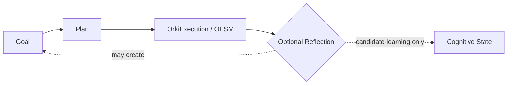
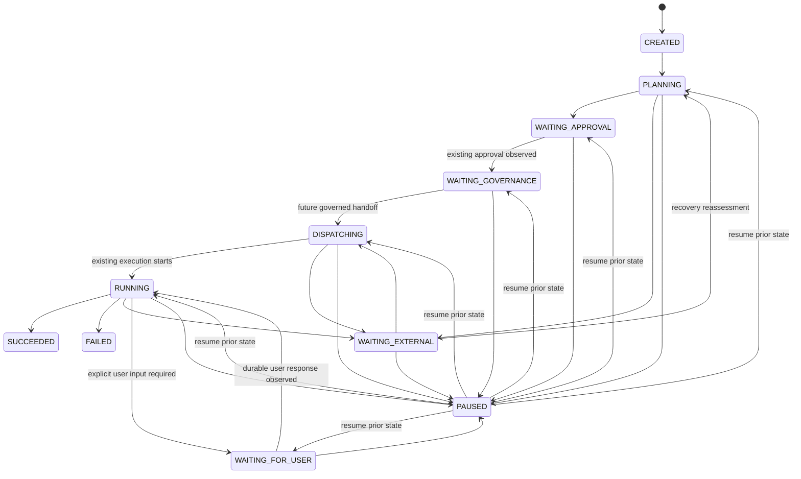
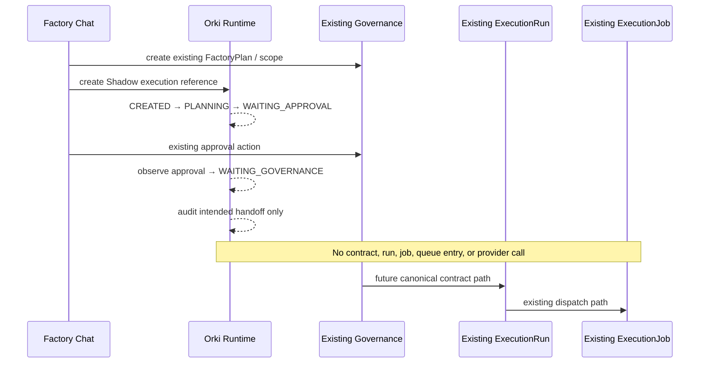
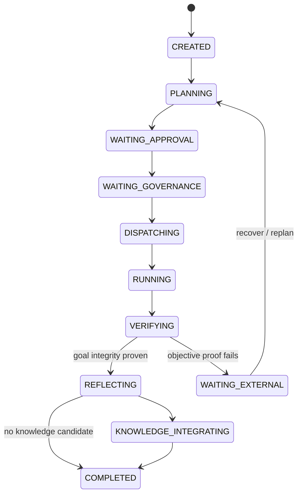

# Canonical Orki Orchestrator Runtime

## Purpose and ownership

Orki Runtime is the provider-independent coordination layer for an approved engineering intent. It answers **"what am I doing now?"**. Cognitive State remains the answer to **"what do I know?"**.

| Concern | Canonical owner |
| --- | --- |
| Knowledge, assumptions, evidence, cognitive goals and plans | Cognitive State |
| Proposal, approval, scope and contract | Governance |
| Governed provider execution, jobs and recovery | `ExecutionRun` / `ExecutionJob` |
| Provider transport | `ExecutionProvider` and provider adapters |
| Runtime coordination and progress projection | Orki Runtime |

Runtime `Goal` and `Plan` are thin execution references. They may point to Cognitive State entries and the existing `FactoryPlan`, but never copy their knowledge or plan body. A Goal may have successive plan versions and every Execution binds one selected Plan.

## Lifecycle and state diagram

Reflection is an extension point only; the Foundation does not implement it or write Cognitive State.

`SUCCEEDED`, `FAILED`, and `CANCELLED` are terminal. `PAUSED` stores its prior state, so resume is deterministic. `WAITING_APPROVAL`, `WAITING_GOVERNANCE`, `WAITING_EXTERNAL`, and `WAITING_FOR_USER` are explicit, inspectable waits. A recovered plan can be dispatched again; this is a retry of the selected plan, not a second execution lifecycle.

## Events, approval and recovery

`OrkiRuntimeEvent` is append-only per execution and has a monotonically increasing sequence. Foundation event types include `EXECUTION_CREATED`, `PLAN_SELECTED`, `COGNITIVE_CONTEXT_REFERENCED`, `STATE_TRANSITION`, `APPROVAL_OBSERVED`, `SHADOW_GOVERNANCE_HANDOFF_RECORDED`, `USER_INPUT_REQUESTED`, `USER_INPUT_RECEIVED`, `PAUSED`, `RESUMED`, `RECOVERY_REQUESTED`, `RECOVERY_REASSESSMENT_STARTED`, `EXECUTION_OPERATION_STARTED`, `EXECUTION_ATTEMPT_FAILED`, `EXECUTION_OPERATION_COMPLETED`, `EXECUTION_CANCELLED`, `GOAL_ACHIEVED`, and `GOAL_CANCELLED`.

Every event records actor identity, structured payload, timestamp and an evidence reference (the scope/approval reference where available, otherwise its stable Runtime execution reference). State changes increment `state_version`. Approval is observed, never manufactured: Runtime accepts only the existing valid `GovernanceApproval` attached to the `FactoryPlan`, records scope/approval references, and waits for the canonical Governance handoff. It creates neither contract nor `ExecutionRun`.

Recovery records intent and may re-enter `PLANNING` from `WAITING_EXTERNAL`; existing execution recovery remains owned by `ExecutionRun`.

`execution_projection` exposes Progress Engine foundation output as `OESM_DERIVED`: a deterministic percentage based solely on the persisted state. It is an observability projection, not a second mutable progress store.

## Canonical Mission E2E acceptance

`projects.tests.test_orki_runtime_mission_e2e` is the required no-mock acceptance test for changes to Runtime, Goal, Plan, OESM, Planning, or their state transitions. It proves a full `Knowledge -> Reasoning -> Planning -> Execution -> Goal Completed` path with canonical Cognitive State entries referenced by (not copied into) Runtime.

The test creates and verifies a real `README.md` inside an isolated temporary test project. Its controlled `execute_shadow_operation` seam is internal-only: it accepts no provider command or file path, creates no authority, and only runs a callable supplied by the acceptance test after the existing approval was observed. This is intentionally not a new provider, queue, Governance flow, or `ExecutionRun`; real production provider dispatch remains with the existing `ExecutionRun` owner.

The mission also induces two real operation failures, pauses and resumes the resulting wait, recovers and retries to success, exercises `WAITING_FOR_USER`, and proves OESM-owned cancellation. Runtime events and progress are asserted from the persisted projection; the test never writes a Runtime state, terminal outcome, event, or progress value directly.

## Factory Chat Shadow Mode

Factory Chat is the first adapter. Shadow Mode proves the Runtime lifecycle without changing Governance, approvals, queueing, `ExecutionRun`, `ExecutionJob`, Cognitive State or evidence ownership.

## Persistence, observability and interfaces

Persistence uses `OrkiGoal`, `OrkiPlan`, `OrkiExecution`, and `OrkiRuntimeEvent`. All cross-domain links reference existing records. Provider context is opaque structured metadata, not a provider command or transcript.

Authenticated API:

- `GET /runtime/executions/{token}/`
- `POST /runtime/executions/{token}/pause/`
- `POST /runtime/executions/{token}/resume/`
- `POST /runtime/executions/{token}/recover/`

Factory Chat shows Runtime state separately from its Cognitive State workspace. The event stream is the audit and observability surface for state, approval, waiting reason, recovery and intended governance handoff.

## Future extensions

Persona Engine can add a selected reasoning perspective to Planning as a reference. Multi-Agent Runtime can attach agent assignments and sub-execution references to a Plan while keeping one parent OESM trail. Both use semantic candidate selection against Cognitive State and existing governed provider/tool boundaries. Neither may introduce a second Cognitive State, approval model, queue, execution lifecycle or evidence store.

## Approved amendment: Reflection and Knowledge Integration

The canonical closure path is now `Goal -> Understanding -> Candidate selection -> Reasoning -> Planning -> Execution preparation -> Execution -> Verification -> Reflection -> Knowledge Integration -> Completed`. `SUCCEEDED` remains a legacy terminal state for existing records; new Runtime completions use `COMPLETED`.

Verification is deterministic Goal Integrity Validation: it compares the original expected outcome and acceptance checks with observed repository changes, build, regression tests and evidence references. It cannot be manually marked successful. Failure is a recoverable Runtime fact and returns to the existing recovery lifecycle.

Reflection persists a run analysis and its evidence references, but cannot write Cognitive State or submit a KnowledgeEntry candidate. The post-MVP Runtime Cleanup removed the legacy `OrkiKnowledgeIntegration` Runtime path. Knowledge Pipeline consumption of `RuntimeKnowledgeCandidate.v1` owns candidate validation, promotion, review, approval, activation, and any embedding/index update. Consequently `embedding.generated` is never emitted by Runtime.

This enforces two platform principles: (11) execution is not knowledge, and (12) reflection precedes knowledge. Runtime events are audit/evidence, not shared knowledge.

## Factory Chat Runtime integration

Factory Chat is a Runtime ingress and presentation adapter, never a provider
dispatcher. A Factory Chat message creates or reuses a live OrkiExecution,
then the Runtime alone performs provider selection and invocation.

The browser consumes the append-only Runtime Event Stream through a bounded
SSE endpoint. The Live Runtime Monitor renders OESM state, Goal, Plan,
derived progress, concrete wait reason, recovery/reflection status, active
Runtime perspective, and evidence count. Network polling is not the source of
Runtime state.

Provider failures transition the execution to WAITING_EXTERNAL with a concrete
structured reason, not a generic chat error. Existing pause, resume, and
recover endpoints retain lifecycle control. Reflection is the only route to a
Knowledge Integration candidate; Factory Chat has no direct Cognitive State
write path.

The canonical Runtime post-execution event contract is: `verification.completed`, `reflection.started`, and `reflection.completed`. Knowledge Pipeline emits its own governed candidate, acceptance, integration, and indexing events. Each carries evidence references.
