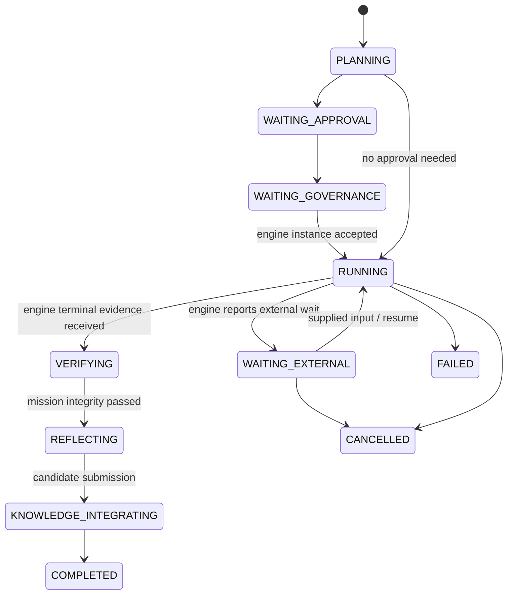
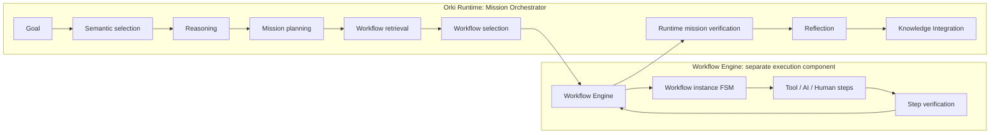

# Orki Runtime and Workflow Engine Architecture Assessment

## Decision

**Recommendation: adopt a separate, embedded Workflow Engine bounded context; retain
Orki Runtime as the Mission Orchestrator.**  This is an evolution of the Runtime
Foundation, not a replacement.  No production code is changed by this assessment.

The evidence supports the Product Owner hypothesis with one important qualification:
the current Runtime is already the canonical *mission* lifecycle owner, but some
Foundation acceptance and ingress seams also execute a supplied callable or invoke a
provider.  Those seams are the refactoring target.  They do not justify moving goal,
approval, verification, reflection, or knowledge ownership into the Workflow Engine.

## Assessment method and evidence boundary

This report was produced under the Factory Development Mode Architecture Assessment
Sprint supplied by the Product Owner on 2026-08-09.  It is evidence and design work
only.  The assessed baseline is `main` at
`bf6f886bb5a08187eafb9cccd02b662ff9856f66`; pre-existing dirty worktree changes are
listed in the FDM execution record and were neither interpreted as this Sprint's work
nor modified.

Primary repository evidence:

| Evidence | Finding |
| --- | --- |
| `projects/models.py` (`OrkiGoal`, `OrkiPlan`, `OrkiExecution`, `OrkiRuntimeEvent`) | Runtime has a durable mission record, versioned plan, append-only event history and mission-level waits/recovery/closure states. |
| `projects/orki_runtime.py` | `execute_shadow_operation` and `execute_structured_decision` execute a supplied callable; `dispatch_factory_chat_execution` selects and invokes a model provider. This is step execution inside Runtime today. |
| `projects/models.py` (`ExecutionRun`, `ExecutionJob`) | Governed provider execution already has a separate established owner. It must remain the provider/transport adapter, not be replaced. |
| `projects/semantic/intelligence.py` | `DjangoVectorStore`, `RetrievalService`, and `SemanticCandidateSelector` provide provider-neutral embedding, vector search, ranking and evidence. Selection intentionally does not select an action. |
| `projects/knowledge_pipeline.py` | Candidate/review/promotion/indexing is separately governed; `retrieve_context` persistently records semantic retrieval evidence. |
| `projects/tests/test_orki_runtime_mission_e2e.py` and `projects/tests/test_factory_acceptance_suite.py` | Current E2Es prove real work, wait/recovery, verification and reflection, but use the Runtime shadow-operation seam. They are valuable regression assets, not proof of a separate workflow FSM. |
| `docs/architecture/ORKI_ORCHESTRATOR_RUNTIME.md` and `docs/architecture/ARCHITECTURE_BASELINE.md` | The documented intent already separates Cognitive State, Governance, Runtime/OESM, providers, verification, reflection and Knowledge Pipeline. |

## Present responsibility map

| Concern | Current owner | Assessment | Target disposition |
| --- | --- | --- | --- |
| Goal, mission plan and mission status | `OrkiGoal`, `OrkiPlan`, `OrkiExecution` | Correct boundary | Stay in Runtime |
| Mission event/audit projection and progress | `OrkiRuntimeEvent`, `execution_projection` | Correct mission-facing projection | Stay in Runtime; consume engine summaries |
| Mission waits, cancellation and recovery intent | OESM transitions in `orki_runtime.py` | Correct at mission granularity | Stay in Runtime |
| Provider execution and delivery | `ExecutionRun` / `ExecutionJob` | Existing governed execution adapter | Stay; invoked by an engine step adapter where applicable |
| Step scheduling, dependencies, branch/loop/retry | Mixed into supplied callables and Runtime transitions | Missing durable boundary | Move to Workflow Engine |
| Provider selection and Factory Chat model call | `dispatch_factory_chat_execution` | Runtime currently performs a workflow step | Replace with engine-start/engine-event adapter |
| Verification of mission goal | Runtime `_validate_goal_integrity` / structured verification | Correct final mission boundary | Stay in Runtime; engine may verify individual steps |
| Reflection and knowledge candidate | Runtime candidates, Knowledge Pipeline | Correct separation from AKB promotion | Stay in Runtime and Knowledge Pipeline |

## OESM: actual role and recommended scope

OESM is best understood as the **Mission Lifecycle State Machine**, not a generic
workflow-step state machine.  Its states (`PLANNING`, approval/governance waits,
`RUNNING`, `VERIFYING`, `REFLECTING`, `COMPLETED`, cancellation and recovery) are
durable, externally meaningful milestones.  The goal and plan models, pause/resume
operations, append-only Runtime events and progress projection corroborate that role.

It should continue to own the following state transition class:

It must not schedule a DAG node, count a per-step retry, decide a branch, or run a
tool/AI/human action.  A Runtime `RUNNING` state means “the selected workflow instance
is active”, not “Runtime is executing its next step.”

## Target responsibility split

The Engine owns a version-pinned `WorkflowInstance`, its per-step records/events,
ready-work calculation, dependencies, retries/backoff, branches, loops, human waits
and executor dispatch.  It reports only typed lifecycle/evidence events to Runtime.
Runtime owns the mission’s planning and lifecycle, progress aggregation, final goal
integrity verification, reflection and hand-off to Knowledge Pipeline.

## What stays, moves and must not change

**Stays:** `OrkiGoal`, `OrkiPlan`, Runtime append-only events and APIs, OESM’s
mission-level waits/recovery/cancellation, Governance and approval observation,
`ExecutionRun`/`ExecutionJob`, Cognitive State boundaries, Knowledge Pipeline review
and embedding promotion, existing provider registry.

**Moves behind a new Engine interface:** direct callable execution in
`execute_shadow_operation` and `execute_structured_decision`, Factory Chat’s provider
invocation in `dispatch_factory_chat_execution`, and any future dependency/branch/loop
semantics.  The first move is an adapter, preserving those callable-based tests.

**Must not change in this migration:** approval policy, contract issuance, provider
credentials, Cognitive State mutation rules, AKB activation, the existing
`ExecutionRun` lifecycle, or accepted mission E2E semantics.  `OrkiKnowledgeIntegration`
is already documented as deprecated and is not a suitable new integration point.

## Critical alternatives

| Alternative | Advantages | Material disadvantage | Decision |
| --- | --- | --- | --- |
| Put workflow FSM in Runtime/OESM | Fewest initial files | Two state granularities in one owner; Runtime keeps executing steps | Reject |
| Re-purpose `ExecutionRun`/`ExecutionJob` as workflow engine | Reuses queue/provider records | Conflates governed provider delivery with reusable workflow control and human/tool/loop semantics | Reject |
| Adopt an external workflow product now | Mature orchestration features | New operational dependency, migration and governance boundary before the domain is proven | Defer |
| Embedded provider-neutral Engine with adapters | Clear ownership, incremental migration, retains existing execution adapters | Requires new persistence/interface and event projection | Recommend |

The recommended design has the lowest long-term coupling without invalidating the
Runtime Foundation.  The detailed canonical design and incremental plan are in the
companion documents.
