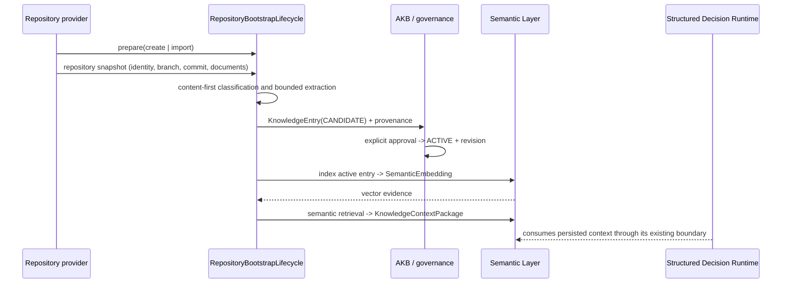

# Repository Bootstrap Lifecycle

## Canonical boundary

`bootstrap_project` remains the canonical Registry and Project Context preflight.
`RepositoryBootstrapLifecycle` is its repository-knowledge stage. A repository
provider owns repository access; the lifecycle service has no Git subprocess,
GitHub CLI, network, credential, or workspace mutation dependency.

Both creation and import call the same `bootstrap` operation. Their only
difference is the provider's `prepare(mode, repository)` action. Once a
snapshot is returned, discovery, intake, governance, semantic indexing and
retrieval use exactly one path.



Repository text is evidence, never direct Runtime knowledge. Every extracted
document first becomes a `KnowledgeEntry` candidate, then a governed active
entry. `RepositoryKnowledgeReceipt` records discovery, promotion, the approval
reference and the derived embedding. `KnowledgeEntry` and its revisions remain
the canonical AKB records; the receipt is not a parallel knowledge store.

## Discovery and classification

The provider supplies documents and their commit SHA. The lifecycle normalizes
and segments content above the AKB size limit without silently truncating it.
Classification counts semantic signals in content for Constitution,
Architecture Decision, System Design, Roadmap, Runbook and Policy. A path can
only break an equal content-score tie. No directory-name rule can independently
classify a document.

Each candidate includes repository path, commit SHA/source version, semantic
classification, SHA-256 fingerprint, document-derived title and evidence
references. The project-scoped AKB type remains extensible, so additional
document classes (for example API or domain model) can be added without a new
repository lifecycle.

## Incremental synchronization

`sync(project, commit_sha, ...)` calls only
`RepositoryProvider.changes_since`. It processes changed documents, marks prior
active entries for the same repository source stale, promotes the approved
replacement and indexes only that active entry. It does not rebuild the
project's full semantic index. Repeating the same source path and SHA returns
the original receipt, so retry is idempotent.

```text
Git commit -> provider diff -> extraction -> candidate -> governed activation
           -> single-entry embedding/index update -> retrieval context
```

## GitHub provider audit

The existing `GitHubAdapter` is a bounded, credential-bound repository-read
adapter. It proves branch-state reads only. It does not presently implement
clone, repository creation, commit-history traversal, diff retrieval or webhook
ingestion. `projects.factory_repositories` separately has guarded GitHub CLI
creation and local workspace initialization for a Factory Mission; it is not a
repository-read provider and must not be called by this lifecycle.

The new `RepositoryProvider` port is the required integration seam for a
GitHub snapshot/diff adapter and for a local clone/test adapter. This keeps
GitHub access provider-driven and prevents the Bootstrap service from calling
Git directly. Remote GitHub mutations and webhook registration remain governed
provider work; no unproved remote capability is claimed by this architecture.

## Runtime readiness

Project readiness is composed, not inferred from a file scan: Registry and
Context must be valid; repository-derived knowledge must be approved and
indexed; retrieval must persist a `KnowledgeContextPackage`; then the existing
Structured Decision Runtime can consume the context under its immutable
operation boundary. Bootstrap neither mutates Runtime nor creates an approval.
