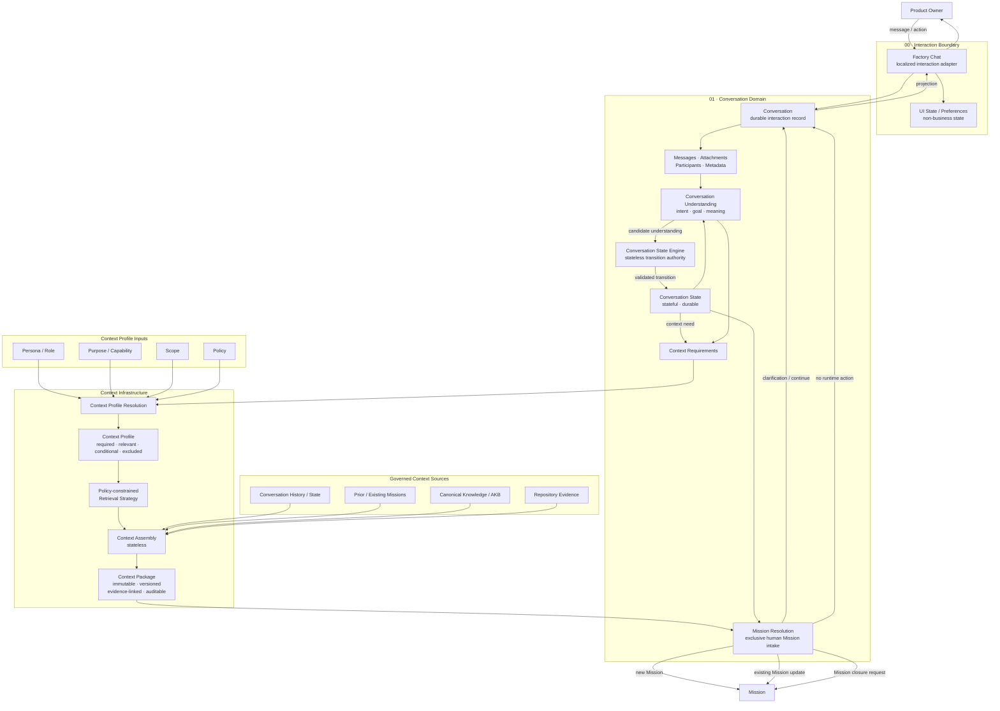

# Diagram Reconciliation — 00 Factory Chat / Interaction Boundary

Status: REVIEWED INPUT / PARTIALLY AUTHORITATIVE
Source: Product Owner supplied Mermaid `00 – Factory Chat Interaction Boundary-2026-08-12-180608.mmd`
Review context: Architecture Convergence 02 closure

## 1. Why this file exists

The supplied Mermaid is valuable because it preserves a previously approved end-to-end view of the 00/01 boundary and the then-current Conversation→Mission path. It MUST be retained as design evidence. However, Architecture Convergence 02 subsequently refined several terms and ownership boundaries, so the diagram cannot be copied unchanged into the final Constitution.

Rule:

> Preserve approved semantic relationships from the diagram, but apply later approved convergence decisions where they supersede older labels or ownership wording.

## 2. Source diagram preserved verbatim



## 3. Semantics that remain consistent and MUST be preserved

### D00-01 — Factory Chat is an interaction adapter, not Runtime

The diagram correctly places Factory Chat at the user/system interaction boundary and keeps Mission/runtime concerns outside it.

### D00-02 — UI state is non-business state

`UI State / Preferences` belongs to the interaction/UI boundary and must not become Conversation canonical business state.

### D00-03 — Conversation is durable and owns interaction record

The diagram correctly represents Conversation as durable interaction history/state rather than transient UI state.

### D00-04 — Conversation owns Messages / Attachments / Participants / Metadata

These are Conversation-domain records, not Factory Chat state.

### D00-05 — Product Owner communication enters through Factory Chat

The user-facing adapter accepts message/action and hands semantic interaction into Conversation.

### D00-06 — Conversation projects information back to Factory Chat

The return direction `Conversation → projection → Factory Chat → Product Owner` remains conceptually correct and directly supports the later Result/Outcome/Projection distinction and `conversation.projection` FactoryIP service family.

### D00-07 — Context Package is immutable/versioned/evidence-linked/auditable

This remains aligned with the accepted Context architecture.

### D00-08 — Context Assembly is stateless

This remains aligned with the target architecture. Ownership/final Node placement remains open, but the processing characteristic is preserved.

### D00-09 — Context is assembled from governed sources

Conversation history/state, existing Missions, AKB/canonical Knowledge and repository evidence are legitimate categories of governed context sources, subject to L0 eligibility/isolation and policy-constrained retrieval.

### D00-10 — Persona/Role, Purpose, Scope and Policy are context/profile-resolution inputs

The diagram preserves an important architectural point: processing configuration/context selection is based on information known before Understanding, rather than on User Intent that has not yet been discovered.

### D00-11 — Mission Resolution is outside Factory Chat

Factory Chat does not create/own Mission business state merely because the Product Owner typed a request.

### D00-12 — Mission may lead to multiple consequences

The diagram preserves that human interaction does not imply only `new Mission`; possible consequences include clarification/continue, existing Mission update, closure request and no runtime action. The exact 03 semantics remain for the 03 convergence.

## 4. Later convergence decisions that supersede or refine diagram wording

### D00-R01 — `Context Profile` → `Cognitive Profile`

The source diagram predates the accepted convergence decision that there SHALL NOT be separate Context/Understanding/Evaluation profile systems.

Replace conceptual structure:

```text
Context Profile Resolution
→ Context Profile
```

with:

```text
Cognitive Profile Resolution
→ Effective Cognitive Profile
   ├── Context Policy
   ├── Understanding Policy
   └── Evaluation Policy
```

The Context Policy may still define required/relevant/conditional/excluded context semantics. Those semantics are not lost; only the standalone `Context Profile` object is superseded.

### D00-R02 — `Conversation Understanding` is an application of Cognitive Processing

The label may remain useful in the 02 course/domain view, but canonical architecture must establish that Conversation Understanding is one application/purpose of reusable stateless Cognitive Processing, not an isolated implementation silo.

### D00-R03 — `intent · goal · meaning` is incomplete as Understanding Result semantics

The final model must also preserve explicit distinctions between Observation, Inference, Assumption, Resolved Reference and Ambiguity, with immutable Understanding Result semantics.

### D00-R04 — `candidate understanding → CSE` must not imply Understanding authority

Understanding produces interpretation. It does not mutate Conversation State. Any transition consequence remains owned by the appropriate domain authority. Detailed CSE semantics are 03 scope.

### D00-R05 — `Context Requirements` must not create a second profile architecture

Context Requirements may remain a request/requirement concept, but resolution must be reconciled with the unified Cognitive Profile model.

### D00-R06 — Retrieval must explicitly obey L0 isolation ordering

`Policy-constrained Retrieval Strategy` is directionally correct but incomplete after convergence 02. Final wording/diagram must show or normatively reference:

```text
Tenant eligibility
→ Scope eligibility
→ Resource authorization
→ Policy eligibility
→ Semantic retrieval
→ Ranking
```

Semantic similarity never overrides isolation.

### D00-R07 — Factory Chat ↔ Conversation communication must use FactoryIP boundary semantics

The direct arrows in this conceptual diagram SHALL NOT be interpreted as internal object/database access.

Target meaning:

```text
Factory Chat Node
→ FactoryIP / published semantic service
→ Conversation Node / conversation.interaction
```

and return:

```text
Conversation Node / conversation.projection
→ FactoryIP
→ Factory Chat Node
```

No internal reach-through is permitted.

### D00-R08 — Conversation must expose semantic services, not CRUD

The final LAN-aware diagram should represent or normatively reference:

- `conversation.interaction`;
- `conversation.context`;
- `conversation.projection`.

It must not imply canonical `conversation.create/update/delete`, `message.create/update`, or external `state.set/transition` services.

### D00-R09 — Context source access must respect FactoryIP/Node boundaries where a real domain boundary is crossed

The source diagram is conceptual and does not model transport. Final architecture must not be read as allowing Context Assembly to reach directly into another Node's internal persistence.

### D00-R10 — Mission Resolution and CSE details are 03 inputs, not newly re-approved 02 semantics

The diagram is evidence of the accepted earlier model, but concrete Conversation State axes, CSE transition rules, Mission readiness and Mission Resolution outcome semantics must be reviewed/closed in section 03.

### D00-R11 — `exclusive human Mission intake` requires 03 reconciliation

This phrase is preserved as prior approved design evidence but should not be freshly constitutionalized by the 02 closure without the 03 review. The accepted baseline remains that Runtime begins only after Mission exists and Factory Chat is not Runtime.

## 5. FactoryIP-aware target interpretation

Without prematurely designing unreviewed later Nodes, the 00/01 boundary should now be understood as:

```text
Product Owner
    │
    ▼
Factory Chat Node
  UI interaction adapter
  UI State / Preferences only
    │
    │ FactoryIP
    │ conversation.interaction
    ▼
Conversation Node
  Conversation
  Messages / Attachments / Participants / Metadata
  Conversation Understanding / Cognitive Processing purpose
  Conversation State (03 detailed review)
    │
    ├── conversation.context ──► authorized consumer / Context Assembly path
    │
    └── conversation.projection
             │ FactoryIP
             ▼
       Factory Chat Node
             │
             ▼
       Product Owner
```

Important: the final consumer/owner of Context Assembly is still OPEN. Do not invent a Node for it in 02.

## 6. Constitutionalization instructions for Codex

When updating canonical diagrams/documents, Codex MUST:

1. retain the source Mermaid as convergence evidence;
2. preserve D00-01 through D00-12 unless an explicit later Product Owner decision supersedes them;
3. apply D00-R01 through D00-R11;
4. replace standalone Context Profile terminology with Cognitive Profile semantics;
5. ensure Factory Chat and Conversation are addressable FactoryIP boundaries/Nodes;
6. ensure arrows across those boundaries mean published semantic service calls, never internal reach-through;
7. keep UI state distinct from Conversation/domain state;
8. keep Context Package immutable/versioned/evidence-linked/auditable;
9. preserve governed context-source semantics but apply L0 isolation and Node-boundary rules;
10. mark concrete CSE/Mission Resolution semantics as 03 review inputs rather than silently changing them;
11. avoid inventing future Nodes/services that have not yet been reviewed;
12. include this diagram in final diagram/text consistency verification.

## 7. Review conclusion

**Assessment: ACCEPT WITH CONVERGENCE REFINEMENTS.**

The supplied Mermaid is consistent with the major approved 00/01 architecture and is valuable authoritative design evidence. It is not safe to adopt verbatim as final 02 constitutional wording because it predates the unified Cognitive Profile model and FactoryIP/Node protocol foundation, and because it contains 03-level CSE/Mission Resolution details that remain subject to the next convergence section.

The correct treatment is therefore: preserve it, trace it, and produce a convergence-updated canonical diagram without losing its approved semantic relationships.