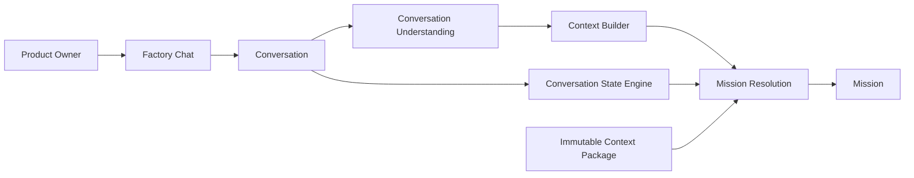

# Diagram 01 — Conversation Layer

```mermaid
flowchart LR
    PO[Product Owner] --> UI[Factory Chat] --> C[Conversation]
    C --> U[Conversation Understanding] --> CB[Context Builder] --> MR[Mission Resolution]
    C --> CSE[Conversation State Engine] --> MR
    CP[Immutable Context Package] --> MR
    MR --> M[Mission]
```
