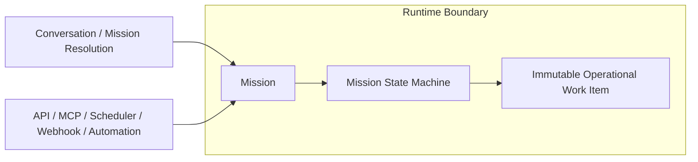

# Diagram 02 — Runtime Boundary

```mermaid
flowchart LR
    C[Conversation / Mission Resolution] --> M[Mission]
    A[API / MCP / Scheduler / Webhook / Automation] --> M
    subgraph RB[Runtime Boundary]
        M --> MSM[Mission State Machine] --> OWI[Immutable Operational Work Item]
    end
```
