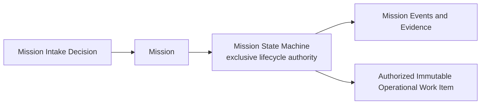

# Diagram 03 — Mission and MSM

```mermaid
flowchart LR
    I[Mission Intake Decision] --> M[Mission]
    M --> MSM[Mission State Machine<br/>exclusive lifecycle authority]
    MSM --> E[Mission Events and Evidence]
    MSM --> OWI[Authorized Immutable Operational Work Item]
```
