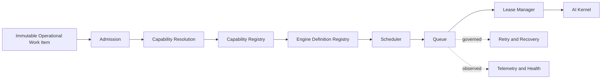

# Diagram 04 — Operational Foundation

```mermaid
flowchart LR
    OWI[Immutable Operational Work Item] --> ADM[Admission] --> CR[Capability Resolution]
    CR --> CAP[Capability Registry] --> ENG[Engine Definition Registry]
    ENG --> SCH[Scheduler] --> Q[Queue] --> L[Lease Manager] --> K[AI Kernel]
    Q -. governed .-> R[Retry and Recovery]
    Q -. observed .-> T[Telemetry and Health]
```
