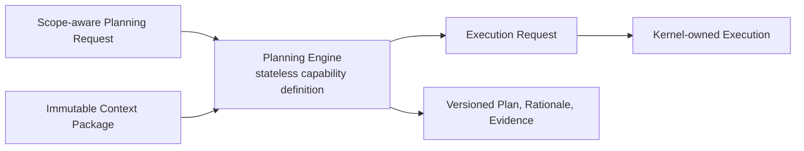

# Diagram 05 — Planning Engine

```mermaid
flowchart LR
    R[Scope-aware Planning Request] --> PE[Planning Engine<br/>stateless capability definition]
    CP[Immutable Context Package] --> PE
    PE --> ER[Execution Request] --> EX[Kernel-owned Execution]
    PE --> O[Versioned Plan, Rationale, Evidence]
```
