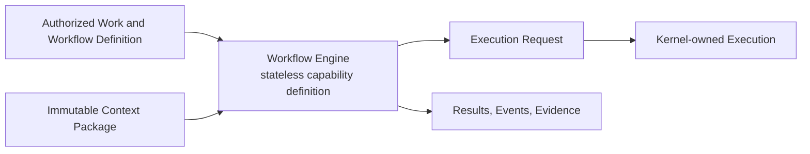

# Diagram 06 — Workflow Engine

```mermaid
flowchart LR
    R[Authorized Work and Workflow Definition] --> WE[Workflow Engine<br/>stateless capability definition]
    CP[Immutable Context Package] --> WE
    WE --> ER[Execution Request] --> EX[Kernel-owned Execution]
    WE --> O[Results, Events, Evidence]
```
