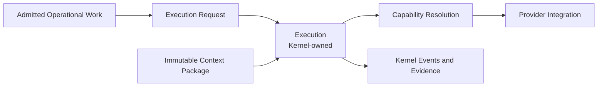

# Diagram 07 — AI Kernel

```mermaid
flowchart LR
    W[Admitted Operational Work] --> ER[Execution Request] --> EX[Execution<br/>Kernel-owned]
    CP[Immutable Context Package] --> EX
    EX --> CR[Capability Resolution] --> PI[Provider Integration]
    EX --> KE[Kernel Events and Evidence]
```
