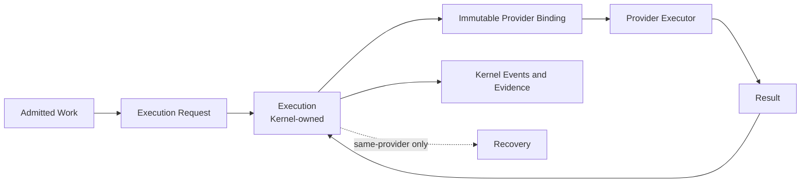

# Diagram 08 — Execution Layer

```mermaid
flowchart LR
    OWI[Admitted Work] --> ER[Execution Request] --> EX[Execution<br/>Kernel-owned]
    EX --> B[Immutable Provider Binding]
    B --> PE[Provider Executor]
    PE --> R[Result] --> EX
    EX --> EE[Kernel Events and Evidence]
    EX -. same-provider only .-> REC[Recovery]
```
