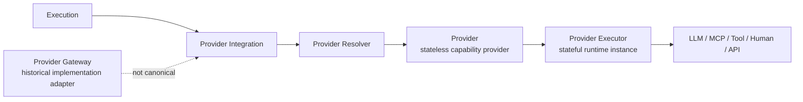

# Diagram 09 — Provider Layer

```mermaid
flowchart LR
    EX[Execution] --> PI[Provider Integration] --> PR[Provider Resolver]
    PR --> P[Provider<br/>stateless capability provider] --> PX[Provider Executor<br/>stateful runtime instance]
    PX --> X[LLM / MCP / Tool / Human / API]
    PG[Provider Gateway<br/>historical implementation adapter] -. not canonical .-> PI
```
