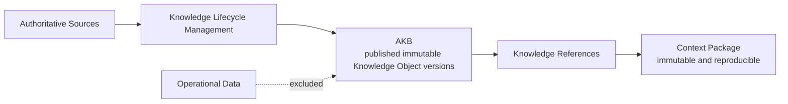

# Diagram 10 — Knowledge and AKB

```mermaid
flowchart LR
    S[Authoritative Sources] --> KLM[Knowledge Lifecycle Management]
    KLM --> AKB[AKB<br/>published immutable Knowledge Object versions]
    AKB --> KR[Knowledge References] --> CP[Context Package<br/>immutable and reproducible]
    O[Operational Data] -. excluded .-> AKB
```
