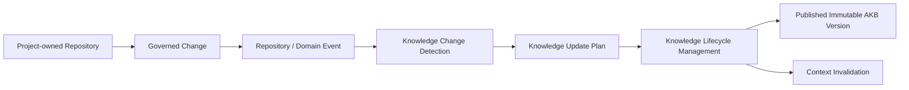

# Diagram 11 — Repository Lifecycle

```mermaid
flowchart LR
    R[Project-owned Repository] --> C[Governed Change]
    C --> E[Repository / Domain Event] --> D[Knowledge Change Detection]
    D --> P[Knowledge Update Plan] --> KLM[Knowledge Lifecycle Management]
    KLM --> AKB[Published Immutable AKB Version]
    KLM --> CI[Context Invalidation]
```
