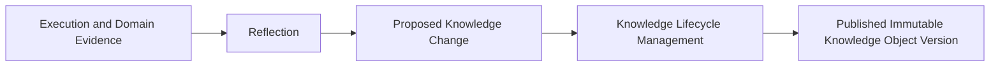

# Diagram 12 — Reflection and Learning

```mermaid
flowchart LR
    E[Execution and Domain Evidence] --> R[Reflection]
    R --> P[Proposed Knowledge Change]
    P --> KLM[Knowledge Lifecycle Management]
    KLM --> AKB[Published Immutable Knowledge Object Version]
```
