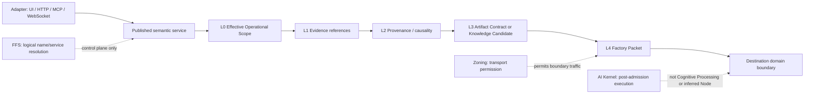

# Diagram 13 - Factory Protocol

FactoryIP is the complete L0-L4 semantic stack. FFS never proxies payloads;
Zoning is distinct from domain authorization; and no Node is implied by an
internal class, process, or endpoint.
