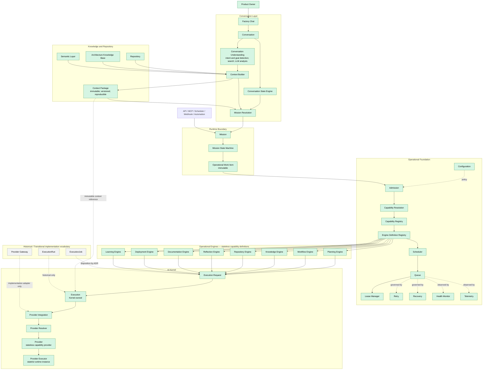

# Diagram 99 — Full Architecture

## Canonical logical architecture

## Reading rules

- `Mission` is the common Runtime intake. Conversation is mandatory only for
  human interaction; non-human adapters converge directly on Mission intake.
- Conversation Understanding and its Context Builder compose the Context
  Package before Mission Resolution. The Runtime consumes the completed
  immutable Context Package and does not directly query AKB or the Repository.
- Operational Foundation resolves a required capability through the Capability
  Registry and Engine Definition Registry. Engines are stateless definitions;
  an engine requests Kernel-owned Execution rather than owning it.
- Provider routing is `Execution → Provider Integration → Provider Resolver →
  Provider → Provider Executor`.
- `ExecutionRun`, `ExecutionJob`, and `Provider Gateway` are historical or
  transitional implementation terms. Their disposition remains ADR-governed
  and they are not canonical target objects.

## Derived visual artifact

[`Full Architecture.drawio`](Full%20Architecture.drawio) is a derived, editable
visualization of this Mermaid model. It may add educational layout and labels,
but it must not alter the components, ownership, or relationships above.
