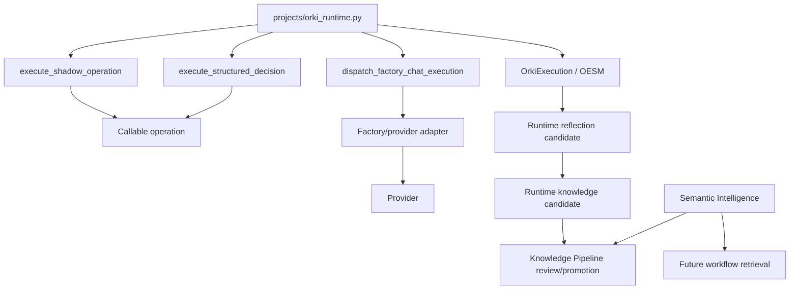

# Architecture Assessment Report — Orki Runtime + Workflow Engine

## Result

**Assessment outcome: the separate Workflow Engine recommendation is justified.**
The repository evidence supports making Runtime the Mission Orchestrator and a new
Workflow Engine the only owner of workflow instance, workflow FSM and step execution.
It does not support a rewrite of the validated Runtime Foundation.

## Questions answered

| Sprint question | Evidence-backed answer |
| --- | --- |
| Where does execution occur now? | Runtime directly invokes supplied operations in `execute_shadow_operation` and `execute_structured_decision`; Factory Chat dispatch also selects/invokes a provider. The established `ExecutionRun`/`ExecutionJob` remains a separate provider execution path. |
| What is OESM’s real role? | Its durable `OrkiExecution` states, Runtime events, waits/recovery/cancel APIs and progress projection make it the mission lifecycle state machine. |
| Where naturally belongs workflow control? | In a separate Engine between planning/selection and mission verification, with its own durable instance/step FSM. |
| What remains correct? | Goals/plans, OESM mission lifecycle, governance observation, Runtime verification/reflection, Semantic Intelligence, Knowledge Pipeline, provider execution records and accepted E2Es. |
| What should be refactored? | Direct Runtime callable and provider dispatch seams, using adapters before deletion. |
| What should not be modified now? | All production behavior. This Sprint is assessment-only. |

## Dependency analysis

The direct arrows from Runtime to callable/provider are the boundary defect.  All
other shown paths are reuse candidates or deliberate ownership boundaries.

## State and flow validation

The focused mission E2E test executes a real file write/read, exercises user wait,
pause/resume, recovery/retry, verification, reflection and goal completion.  The
Factory acceptance suite executes a real temporary Git repair plus build and
regression checks.  These tests demonstrate that a transition from direct callables to
an Engine adapter can be measured without weakening “real work” acceptance.

The present `OrkiExecution` model contains both mission states and historical
execution-progression names.  The refactor must not create an alternative Runtime
state machine.  It must instead introduce the independent workflow state model and
project its summaries into OESM’s established mission-level states.

## Proposed decision record

- Architecture decision: **ADR recommended — Runtime Mission Orchestrator + embedded
  Workflow Engine**.
- Confidence: high for boundary direction; medium for exact template storage schema,
  which requires a future approved design Sprint and migration spike.
- Preferred implementation order: characterization → Engine contracts → persistence →
  shadow adapter → provider adapter → retrieval → learning → deprecation.
- Rejected premature actions: external workflow platform adoption, replacement of
  `ExecutionRun`, or immediate removal of direct Runtime seams.

## Assessment limitations

No live provider, queue or managed Bridge worker was invoked.  That is appropriate for
this documentation-only Factory Development Mode assessment.  It does mean the future
AI-step executor needs dedicated governed integration evidence before it can be
considered implemented.  The pre-existing dirty worktree prevents claiming an
independently clean repository baseline; the exact state is recorded separately.
