# Architecture Convergence 02 — execution-ready specification

**Status:** READY FOR PRODUCT OWNER REVIEW — specification only.  This Epic is
not authority to amend the Constitution, change runtime code, schemas, APIs,
migrations, or delete legacy architecture. Those changes require a separately
approved execution scope after this Epic is accepted.

## Decision lock and non-negotiable boundaries

The authoritative semantic input is the local source-derived package in this
directory: `DECISION_LEDGER.md`, `TARGET_ARCHITECTURE.md`,
`NEGATIVE_INVARIANTS.md`, `OPEN_QUESTIONS.md`,
`02_CONSTITUTION_AMENDMENT_REQUIREMENTS.md`, and the primary CHAT locators in
`APPROVAL_REGISTER.md`. The current Constitution and repository are baseline
for comparison, never an override of R-01–R-31.

**Hard invariant:** `AI Kernel != Cognitive Processing`. The Kernel must not
own Cognitive Processing, Context Assembly, Understanding, or Evaluation; no
Kernel FactoryIP/LAN integration may be inferred. Kernel LAN integration is
**OPEN / future review**. Superseded diagrams cannot become canonical.

**Course boundary:** Section 02 covers Conversation Understanding / Cognitive
Processing and its approved cross-cutting Factory Protocol foundation. Section
03 (Conversation State & Mission Resolution), 04 (Mission), and 05 (MSM) are
not designed here. Discoveries belonging there are recorded as INPUT, OPEN, or
DEFERRED, never silently adopted.

## Global execution rules

Every work package (WP) below has the same mandatory delivery card fields:
Objective; Source decisions; Primary evidence; Approved target semantics;
Positive invariants; Negative invariants; Explicit non-responsibilities;
Dependencies; Current repository assessment required; Constitution impact;
Architecture challenge; Required changes; Forbidden changes; Migration
considerations; Required tests; Runtime verification; Evidence required;
Acceptance criteria; STOP / Product Owner decision conditions; Closure output.
The cards populate each field below; “future” means a required later execution
action, not a current-task authorization.

If an implementation decision is not fixed by an accepted R-decision, STOP only
the affected WP and create a Product Owner Decision Required item stating the
missing decision, dependency, alternatives, recommendation, affected WPs, and
deferral effect. Neither current code, generic practice, Codex preference,
superseded diagrams, nor a later-section concept may fill that gap. Independent
WPs may continue. Architecture Challenge may expose a better alternative but
may never amend the approved target.

## Dependency graph and safe parallelism

```mermaid
flowchart LR
  W00[WP-00 decision lock] --> W01[WP-01 terminology / authority]
  W01 --> W02[WP-02 Conversation + Cognitive]
  W01 --> W03[WP-03 L0]
  W03 --> W04[WP-04 L1] --> W05[WP-05 L2] --> W06[WP-06 L3] --> W08[WP-08 L4]
  W06 --> W07[WP-07 Result / Outcome / Projection / Claim]
  W08 --> W09[WP-09 FactoryIP] --> W10[WP-10 Node / services] --> W11[WP-11 FFS] --> T[Topology understanding] --> W12[WP-12 Zoning]
  W02 --> W13[WP-13 Kernel protection]
  W07 --> W14[WP-14 Constitution / ADR]
  W12 --> W14
  W13 --> W14
  W14 --> W15[WP-15 Mermaid] --> W16[WP-16 repository assessment] --> W17[WP-17 implementation plan] --> A[Separate PO approval] --> W18[WP-18 implementation / verification] --> W19[WP-19 evidence] --> W20[WP-20 sweep] --> W21[WP-21 closure]
```

After WP-01, WP-02 and WP-03 may run in parallel; after L0 is stable, the
protocol chain remains ordered. WP-07 may run alongside the latter part of
WP-06, but must close before WP-14. WP-13 and diagram inventory work may run
in parallel with semantic work but must pass before constitutional adoption.
No implementation assessment precedes canonical semantic and constitutional
convergence.

## Work packages

### WP-00 — Execution Baseline & Decision Lock

**Objective:** freeze authorized source semantics. **Source decisions:** R-01,
R-02, R-29–R-31. **Primary evidence:** `CHAT-0003`–`0012`, `0369`–`0382`,
`0396`–`0423`. **Approved target semantics:** source reconstruction precedes
baseline comparison. **Positive invariants:** each change has R/CHAT lineage;
accepted/refined/superseded/open/deferred states are explicit. **Negative
invariants:** do not trust historical decision IDs or old convergence docs as
primary source. **Explicit non-responsibilities:** no implementation or
amendment. **Dependencies:** none. **Current repository assessment required:**
baseline SHA, branch, canonical-doc inventory. **Constitution impact:** record
only. **Architecture challenge:** identify collisions, not replacements.
**Required changes:** decision and locator lock. **Forbidden changes:** target
invention. **Migration considerations:** none. **Required tests / Runtime
verification:** evidence consistency only / none. **Evidence required:**
baseline record and decision register. **Acceptance criteria:** every later WP
has an R/CHAT source. **STOP / PO:** unresolved source conflict. **Closure
output:** locked decision inventory and later-section register.

### WP-01 — Terminology & Authority Convergence

**Objective:** establish vocabulary, owner, state authority, inputs/outputs,
non-responsibility, and adjacent boundary for Factory Chat, Conversation,
Conversation State/CSM, Cognitive Processing/Profile/Effective Profile,
Context Assembly/Package, Understanding/Evaluation, Mission Resolution,
Mission/MSM, Operational Foundation, AI Kernel, Execution, Artifact/Evidence/
Claim, Factory Message/IP, Node, FFS, and Zoning. **Source decisions:**
R-03–R-12, R-20–R-30. **Primary evidence:** `CHAT-0031`–`0178`, `0245`–`0382`.
**Approved target semantics:** ownership is separated; AI Kernel is execution
core, not Cognitive Processing. **Positive invariants:** named owner and state
writer per concept. **Negative invariants:** no duplicate state authority or
Kernel conflation. **Explicit non-responsibilities:** do not settle 03/04/05
semantics. **Dependencies:** WP-00. **Current repository assessment required:**
canonical terminology and symbol inventory. **Constitution impact:** Articles
III/IV, Scope, AKB, Operational Foundation. **Architecture challenge:** detect
synonyms that hide a second owner. **Required changes:** controlled glossary
and cross-reference map. **Forbidden changes:** rename code as a shortcut.
**Migration considerations:** terminology aliases need explicit deprecation.
**Required tests / Runtime verification:** documentation-reference validation /
none. **Evidence required:** authority matrix. **Acceptance criteria:** every
listed concept has the six declared fields. **STOP / PO:** a term needs
semantics absent from R decisions. **Closure output:** approved terminology map.

### WP-02 — Conversation + Cognitive Processing Convergence

**Objective:** converge stateless understanding, profile/scope resolution,
Context Assembly/Package, Evaluation, immutable results, CSM boundary, and
Mission/Knowledge publication boundaries. **Source decisions:** R-03–R-12.
**Primary evidence:** `CHAT-0031`–`0150`. **Approved target semantics:** CU/CP
are reusable stateless consumers; results are immutable; Evaluation separates
history from present applicability; CSM orchestrates Conversation transitions.
**Positive invariants:** profile/policy resolves before processing; evidence
links result and transition. **Negative invariants:** CU has no Conversation
write or domain-consequence authority; resolver does not solicit/repair;
CSM is not universal master; Kernel owns none of this. **Explicit
non-responsibilities:** no Mission Resolution, Mission, or MSM design.
**Dependencies:** WP-01. **Current repository assessment required:** call
graph, state/write paths, service/API contracts, ownership inventory and tests.
**Constitution impact:** amendment requirements §§1–2. **Architecture
challenge:** detect hidden mutation and lifecycle ownership. **Required
changes:** only after gap evidence, separate stateful domain from stateless
capability. **Forbidden changes:** put CP in Kernel. **Migration
considerations:** preserve historical results and correlate transitions.
**Required tests:** contract, write-path, result immutability, profile-failure,
and transition tests. **Runtime verification:** controlled conversation flow
proves no direct CP state write. **Evidence required:** target/current/gap map.
**Acceptance criteria:** all R-03–R-12 have owner and verified disposition.
**STOP / PO:** schema/policy detail not decided. **Closure output:** Section-02
cognitive convergence package.

### WP-03 — L0 Effective Operational Scope & Isolation

**Objective:** converge Effective Operational Scope and isolation. **Source
decisions:** R-09, R-15. **Primary evidence:** `CHAT-0113`–`0118`, `0165`–`0178`.
**Approved target semantics:** scope identity is distinct from resolved
resource/policy/profile bindings; eligibility precedes semantic retrieval.
**Positive invariants:** tenant/workspace/project/resource context and approved
profile bindings are explicit. **Negative invariants:** do not invent a new
scope model or move domain authorization into transport. **Explicit
non-responsibilities:** topology and L4 authorization. **Dependencies:** WP-01.
**Current repository assessment required:** scope propagation, retrieval and
authorization inventory. **Constitution impact:** amendment requirements §3 L0.
**Architecture challenge:** find cross-scope leakage and duplicate eligibility.
**Required changes:** bind only source-approved scope fields. **Forbidden
changes:** replace eligibility with arbitrary retrieval. **Migration
considerations:** version resolved bindings. **Required tests:** isolation,
eligibility-before-retrieval, policy binding. **Runtime verification:** scoped
request cannot read an ineligible source. **Evidence required:** scope map.
**Acceptance criteria:** L0 inputs, owner and boundaries are proven. **STOP /
PO:** exact unresolved contract schema. **Closure output:** L0 specification.

### WP-04 — L1 Evidence Protocol

**Objective:** converge contract-defined evidence at handoffs. **Source
decisions:** R-14, R-16. **Primary evidence:** `CHAT-0161`–`0164`, `0180`–`0192`.
**Approved target semantics:** evidence is attributable proof/support with
defined authority, granularity, sufficiency, integrity and retrieval—not mere
logging or authority. **Positive invariants:** generation source and decision/
change relation are explicit. **Negative invariants:** evidence does not own
domain facts or replace causality. **Explicit non-responsibilities:** no L2
truth assertion. **Dependencies:** WP-03. **Current repository assessment
required:** evidence schema, producers, retention and audit paths.
**Constitution impact:** amendment requirements §3 L1. **Architecture
challenge:** detect optional/unattributable logging. **Required changes:**
contract-defined evidence records. **Forbidden changes:** infer business
authority from evidence. **Migration considerations:** preserve existing audit
history. **Required tests:** attribution, integrity, sufficiency and retrieval.
**Runtime verification:** reconstruct a selected handoff. **Evidence required:**
handoff inventory. **Acceptance criteria:** every required handoff has an
owner and sufficiency rule. **STOP / PO:** source lacks required detailed
record schema. **Closure output:** L1 contract proposal.

### WP-05 — L2 Provenance & Causality Protocol

**Objective:** converge provenance/causal relation semantics. **Source
decisions:** R-17–R-19. **Primary evidence:** `CHAT-0194`–`0240`.
**Approved target semantics:** relation families, direction/inverse semantics,
temporal/version lifecycle, activation authority/evidence, challenge and
assurance are explicit; history appends rather than erases. **Positive
invariants:** relation status and evidence are distinguishable. **Negative
invariants:** no destructive deletion; RETRACTED is not unresolved/pending.
**Explicit non-responsibilities:** no Artifact dependency subsystem duplicating
L2. **Dependencies:** WP-04. **Current repository assessment required:** graph,
relation write paths, lifecycle storage and consumers. **Constitution impact:**
§3 L2. **Architecture challenge:** detect causal claims encoded as logs.
**Required changes:** canonical relation registry/lifecycle proposal.
**Forbidden changes:** overwrite/retract history silently. **Migration
considerations:** append status history. **Required tests:** direction,
challenge, re-evaluation, lifecycle. **Runtime verification:** challenged
relation remains auditable. **Evidence required:** relation inventory.
**Acceptance criteria:** R-17–R-19 trace to canonical form. **STOP / PO:**
unapproved relation taxonomy narrowing. **Closure output:** L2 specification.

### WP-06 — L3 Artifact / Knowledge Architecture

**Objective:** converge Artifact, Artifact Identity/Version/Contract,
materialization/payload, integrity, composition, applicability, retention,
Evidence, Knowledge Candidate/Publication/Resolution and conflicts. **Source
decisions:** R-13, R-20–R-22. **Primary evidence:** `CHAT-0155`–`0164`,
`0245`–`0297`; `CHAT-0295` directly accepts FP-L3/11–17. **Approved target
semantics:** same identity vs new version vs new Artifact is explicit; artifact
versions and payloads are immutable; L2 owns composition/provenance; historical
validity differs from current applicability; Knowledge is selected semantic
publication, not wholesale Artifact copy. **Positive invariants:** contract
qualifies identity, lifecycle/governance, integrity and authority. **Negative
invariants:** no mutable overwrite, no L3 retention/auth subsystem, no direct
external-authority resolution, no automatic Artifact-to-AKB conversion.
**Explicit non-responsibilities:** no invented consolidated schema or universal
resolver. **Dependencies:** WP-05. **Current repository assessment required:**
artifact/evidence/knowledge schemas, publication paths, migrations and tests.
**Constitution impact:** §3 L3, §6, §7. **Architecture challenge:** distinguish
payload storage, semantic identity and knowledge ownership. **Required
changes:** source-bound contracts and publication boundary. **Forbidden changes:**
payload mutation or duplicate dependencies. **Migration considerations:**
version/new-materialization and retention need forward plan. **Required tests:**
immutable version, digest/integrity, applicability, knowledge publication and
conflict tests. **Runtime verification:** demonstrate an immutable version and
separate publication decision. **Evidence required:** `CHAT_0295...` trace,
schema/current-gap inventory. **Acceptance criteria:** each FP-L3/11–17 has a
disposition. **STOP / PO:** implementation requires missing exact schema or
retention decision. **Closure output:** L3 convergence and decision-gap list.

### WP-07 — Result / Outcome / Projection / Claim Reconciliation

**Objective:** retain these distinct semantic roles across cognitive, domain,
transport, Artifact and Evidence boundaries. **Source decisions:** R-07,
R-11–R-12, R-22–R-23. **Primary evidence:** `CHAT-0085`–`0086`, `0131`–`0150`,
`0275`–`0304`. **Approved target semantics:** immutable result is not domain
consequence; outcome routes to the right actor; projection is a view; Claim is
an owner-bearing resolution case, not every ambiguity. **Positive invariants:**
each has owner/lifecycle/boundary. **Negative invariants:** no collapse into
payload or generic uncertainty bucket. **Explicit non-responsibilities:** no
new universal resolution application. **Dependencies:** WP-06. **Current
repository assessment required:** result/outcome/projection/claim models and
consumers. **Constitution impact:** §§2, 6–7. **Architecture challenge:** find
hidden state encoded as view. **Required changes:** terminology/contract
separation. **Forbidden changes:** derive authority from transport. **Migration
considerations:** preserve historic results. **Required tests:** owner and
immutability contracts. **Runtime verification:** projection cannot mutate
source state. **Evidence required:** mapping table. **Acceptance criteria:**
no category is orphaned. **STOP / PO:** missing lifecycle detail. **Closure
output:** reconciliation matrix.

### WP-08 — L4 Factory Message Protocol

**Objective:** converge Factory Message as envelope, delivery/interaction
semantics, then payload at genuine protocol/domain boundaries. **Source
decisions:** R-15, R-23. **Primary evidence:** `CHAT-0285`–`0304`.
**Approved target semantics:** L4 is not resolution-only; lower layers remain
independent and layer-specific information remains readable. **Positive
invariants:** boundary and delivery responsibility explicit. **Negative
invariants:** no global authorization, generic internal-call wrapper, or
duplicate communication contract. **Explicit non-responsibilities:** no
universal resolver. **Dependencies:** WP-06 and WP-07. **Current repository
assessment required:** message boundaries, payload contracts, adapters.
**Constitution impact:** §3 L4. **Architecture challenge:** detect CRUD or
service-mesh creep. **Required changes:** L4 contract only. **Forbidden
changes:** make packet a generic API. **Migration considerations:** map legacy
messages by boundary. **Required tests:** envelope/delivery/payload separation.
**Runtime verification:** packet crosses a real boundary without authority
leak. **Evidence required:** protocol map. **Acceptance criteria:** R-23 is
fully represented. **STOP / PO:** unapproved envelope schema. **Closure output:**
L4 specification.

### WP-09 — FactoryIP

**Objective:** converge FactoryIP/Factory Packet as accumulated L0–L4 boundary
stack. **Source decisions:** R-15, R-23–R-24. **Primary evidence:**
`CHAT-0301`–`0330`. **Approved target semantics:** each domain contributes its
boundary information; FactoryIP is not CRUD. **Positive invariants:**
addressing, routing interaction, service invocation and security boundaries are
explicit. **Negative invariants:** no generic transport-only abstraction.
**Explicit non-responsibilities:** no topology or Node qualification decision.
**Dependencies:** WP-08. **Current repository assessment required:** adapters,
calls, packet candidates and security boundaries. **Constitution impact:** §4.
**Architecture challenge:** detect bypass paths. **Required changes:** complete
layer stack contract. **Forbidden changes:** flatten layers. **Migration
considerations:** compatibility only after target is canonical. **Required
tests:** layer completeness and boundary contracts. **Runtime verification:**
source-to-destination packet trace. **Evidence required:** packet path map.
**Acceptance criteria:** R-24 maps to named contracts. **STOP / PO:** exact
addressing schema absent. **Closure output:** FactoryIP specification.

### WP-10 — FactoryIP Node & Published Semantic Services

**Objective:** converge qualified Nodes and semantic published services.
**Source decisions:** R-27. **Primary evidence:** `CHAT-0339`–`0350`.
**Approved target semantics:** Node identity differs from service/endpoint;
Factory Chat is an addressable UI node, never Runtime or Conversation owner.
**Positive invariants:** service addressing and qualification are explicit.
**Negative invariants:** no public generic CRUD or direct cross-domain state
mutation. **Explicit non-responsibilities:** no Kernel Node classification.
**Dependencies:** WP-09. **Current repository assessment required:** node/API/UI
ownership map. **Constitution impact:** §4–5. **Architecture challenge:**
detect reach-through adapters. **Required changes:** semantic service families.
**Forbidden changes:** publish `conversation.transition` as generic mutation.
**Migration considerations:** compatibility mapping needs a proposal.
**Required tests:** external adapter/no-reach-through and UI ownership. **Runtime
verification:** Factory Chat invokes a semantic service only. **Evidence
required:** service map. **Acceptance criteria:** Factory Chat boundary proven.
**STOP / PO:** unapproved service family. **Closure output:** Node/service map.

### WP-11 — Factory Fabric Service / FFS

**Objective:** converge MVP FFS. **Source decisions:** R-25. **Primary
evidence:** `CHAT-0311`–`0328`. **Approved target semantics:** one logical
authority, physically distributable, thin static/name-routing control plane;
not data-plane proxy; HA/failover deferred. **Positive invariants:** service
resolution has named authority. **Negative invariants:** no proxy, active-active
cluster, dynamic lease system or service mesh by assumption. **Explicit
non-responsibilities:** payload transport and HA design. **Dependencies:**
WP-10. **Current repository assessment required:** routing/name-resolution
components. **Constitution impact:** §4. **Architecture challenge:** eliminate
over-engineering. **Required changes:** only source-bound control-plane model.
**Forbidden changes:** proxy packet path. **Migration considerations:** retain
logical identity. **Required tests:** static routing and no-proxy path.
**Runtime verification:** direct packet path with FFS lookup. **Evidence
required:** control/data-plane map. **Acceptance criteria:** deferred HA is
recorded. **STOP / PO:** physical topology/HA choice. **Closure output:** MVP
FFS design.

### WP-12 — Zoning

**Objective:** converge canonical communication authorization. **Source
decisions:** R-26. **Primary evidence:** `CHAT-0322`–`0328`, `0355`–`0358`.
**Approved target semantics:** Zoning is firewall-like source-to-destination
communication eligibility, separate from domain authorization, finalized after
topology. **Positive invariants:** node/service communication policy is
explicit. **Negative invariants:** no revived inbound/outbound/forbidden
contract or global business authorization. **Explicit non-responsibilities:**
final topology rule design before topology exists. **Dependencies:** WP-11 and
topology understanding. **Current repository assessment required:** network/API
boundaries and authorization layers. **Constitution impact:** §4. **Architecture
challenge:** identify duplicated authorization. **Required changes:** one
communication permission model. **Forbidden changes:** domain-policy takeover.
**Migration considerations:** classify every old rule. **Required tests:**
allow/deny/isolation. **Runtime verification:** deny unauthorized path while
domain authorization remains separate. **Evidence required:** zoning matrix.
**Acceptance criteria:** all communication rules have a topology basis. **STOP
/ PO:** unresolved topology. **Closure output:** Zoning proposal/deferred list.

### WP-13 — AI Kernel Protection & Reconciliation

**Objective:** prove 02 does not corrupt existing Kernel architecture. **Source
decisions:** R-28, R-30. **Primary evidence:** `CHAT-0351`–`0354`, `0365`–`0382`.
**Approved target semantics:** Kernel remains operational execution core;
detailed LAN integration remains open. **Positive invariants:** Kernel execution
responsibility preserved. **Negative invariants:** Kernel != CP; no Kernel
Context Assembly/Understanding/Evaluation ownership, Node inference, LAN
inference, or superseded diagram. **Explicit non-responsibilities:** Kernel
redesign. **Dependencies:** WP-02, WP-09–WP-12 inventory. **Current repository
assessment required:** Articles III/IV and diagram/API boundary scan.
**Constitution impact:** amendment requirements §2/§8. **Architecture challenge:**
detect accidental imports. **Required changes:** protection findings and
corrections only after separate scope. **Forbidden changes:** add Kernel LAN
role. **Migration considerations:** none until PO review. **Required tests:**
architecture reference scan. **Runtime verification:** none until a reviewed
Kernel boundary exists. **Evidence required:** Kernel separation report.
**Acceptance criteria:** zero canonical conflation. **STOP / PO:** any LAN
integration decision. **Closure output:** PASS/open Kernel boundary report.

### WP-14 — Constitution & ADR Convergence

**Objective:** after semantics are stable, prepare exact amendment/ADR deltas.
**Source decisions:** R-03–R-30. **Primary evidence:** all mapped locators;
especially `02_CONSTITUTION_AMENDMENT_REQUIREMENTS.md`. **Approved target
semantics:** canonical architecture follows source target before implementation.
**Positive invariants:** each delta states old text, target text, R source,
reason, references, diagrams and compatibility. **Negative invariants:** no
single Conversation article absorbs every cross-cutting concern. **Explicit
non-responsibilities:** amendment in this Epic-authoring task. **Dependencies:**
WP-02–WP-13 accepted. **Current repository assessment required:** all named
Constitution Books/ADRs and conflicts. **Constitution impact:** §§1–9 are the
minimum amendment map. **Architecture challenge:** detect contradiction.
**Required changes:** future controlled Book/ADR adoption. **Forbidden changes:**
code-led Constitution. **Migration considerations:** explicitly record rejected
legacy concepts. **Required tests:** doc/link/conflict validation. **Runtime
verification:** none before separately authorized implementation. **Evidence
required:** amendment diff and ADR rationale. **Acceptance criteria:** one
coherent canonical target. **STOP / PO:** missing target semantic or placement
choice with material meaning. **Closure output:** approved amendment package.

### WP-15 — Mermaid Convergence

**Objective:** classify and reconcile architecture diagrams. **Source
decisions:** R-03–R-30, chiefly R-28. **Primary evidence:** diagram register and
`CHAT-0351`–`0370`. **Approved target semantics:** diagrams reflect accepted
semantics and state classification. **Positive invariants:** canonical/refined/
superseded/historical/03-input/open status visible. **Negative invariants:** no
Kernel=CP or unsupported Kernel LAN edge. **Explicit non-responsibilities:**
inventing missing topology. **Dependencies:** WP-14. **Current repository
assessment required:** Mermaid/drawio/index inventory. **Constitution impact:**
canonical visual companion updates. **Architecture challenge:** compare graphic
and textual authority. **Required changes:** future diagram reconciliation.
**Forbidden changes:** promote historical diagram. **Migration considerations:**
keep auditable supersession. **Required tests:** Mermaid parse/render and
semantic scan. **Runtime verification:** none. **Evidence required:** diagram
register. **Acceptance criteria:** every diagram classified. **STOP / PO:**
diagram requires new topology. **Closure output:** canonical diagram set.

### WP-16 — Repository Implementation Assessment

**Objective:** establish Target vs Current vs Gap only after canonical target.
**Source decisions:** R-03–R-30. **Primary evidence:** WP outputs and current
repository. **Approved target semantics:** implementation must not redefine
target. **Positive invariants:** call graph, write paths, schemas, APIs,
runtime, dependencies, tests, migrations, UI/MCP and security are evidenced.
**Negative invariants:** no implementation begins during assessment. **Explicit
non-responsibilities:** gap repair. **Dependencies:** WP-14–WP-15. **Current
repository assessment required:** complete listed inventory. **Constitution
impact:** validate adopted canonical sections. **Architecture challenge:** rank
duplicate authority and compatibility risk. **Required changes:** assessment
documents only. **Forbidden changes:** speculative refactor. **Migration
considerations:** list before planning. **Required tests:** read-only existing
suite inventory. **Runtime verification:** observation only. **Evidence
required:** target/current/gap matrix. **Acceptance criteria:** each decision
has implementation disposition. **STOP / PO:** unclear canonical target.
**Closure output:** signed repository impact assessment.

### WP-17 — Implementation Plan & Migration Plan

**Objective:** turn accepted gaps into bounded executable changes. **Source
decisions:** decision-specific per WP-16. **Primary evidence:** WP-16 gap
matrix. **Approved target semantics:** pre-MVP wrong architecture need not be
preserved for compatibility (R-01). **Positive invariants:** every gap has
files/components, migration, compatibility/removal, tests, runtime proof and
evidence. **Negative invariants:** no unrelated breakage. **Explicit
non-responsibilities:** implementation without approval. **Dependencies:**
WP-16. **Current repository assessment required:** affected-file confirmation.
**Constitution impact:** bind plan to approved delta. **Architecture challenge:**
check circular dependencies/hidden state. **Required changes:** future child
Sprint plans. **Forbidden changes:** silent scope expansion. **Migration
considerations:** forward-only, reproducible, no destructive data loss.
**Required tests:** exact commands in each child contract. **Runtime
verification:** exact scenario per change. **Evidence required:** child-plan
matrix. **Acceptance criteria:** no unbound gap. **STOP / PO:** any new
architecture. **Closure output:** approval-ready implementation Sprints.

### WP-18 — Implementation & Verification

**Objective:** execute only separately approved child scopes. **Source
decisions:** bound child decision set. **Primary evidence:** approved child
contract. **Approved target semantics:** implementation follows Constitution,
not convenience. **Positive invariants:** architecture is proven by unit,
contract, transition/write-path, isolation, security/zoning, protocol,
migration, UI/API ownership, integration and runtime checks as applicable.
**Negative invariants:** no test-only compliance or bypass. **Explicit
non-responsibilities:** execution under this specification task. **Dependencies:**
WP-17 plus PO approval. **Current repository assessment required:** child scope.
**Constitution impact:** no deviation. **Architecture challenge:** rerun before
irreversible change. **Required changes:** approved child work only. **Forbidden
changes:** unapproved migration/API/schema. **Migration considerations:** child
rollback/repair evidence. **Required tests:** exact child gate suite. **Runtime
verification:** required accepted scenario. **Evidence required:** final-state
machine and acceptance evidence. **Acceptance criteria:** all gates pass.
**STOP / PO:** contract mismatch. **Closure output:** child closure report.

### WP-19 — Evidence + Knowledge Update

**Objective:** preserve CHAT→decision→Constitution→implementation→verification
provenance. **Source decisions:** R-14, R-16 and each implemented decision.
**Primary evidence:** source package and child evidence. **Approved target
semantics:** evidence is first-class and Knowledge publication is governed.
**Positive invariants:** durable, attributable chain. **Negative invariants:**
no transcript as automatic Knowledge. **Explicit non-responsibilities:** no
unreviewed AKB promotion. **Dependencies:** WP-18. **Current repository
assessment required:** evidence/AKB workflow. **Constitution impact:** §§3 L1,
§6. **Architecture challenge:** detect evidence gaps. **Required changes:**
update accepted knowledge records. **Forbidden changes:** manufacture proof.
**Migration considerations:** retain provenance. **Required tests:** evidence
reference integrity. **Runtime verification:** evidence reconstructs run.
**Evidence required:** complete chain. **Acceptance criteria:** audit lookup
succeeds. **STOP / PO:** required knowledge publication decision absent.
**Closure output:** evidence manifest and knowledge update receipt.

### WP-20 — Repository-Wide Consistency Sweep

**Objective:** classify every repository hit for superseded terminology,
ownership, diagrams, APIs, communication contracts, Kernel/CP conflation,
FactoryIP, Artifact and authorization duplicates. **Source decisions:**
R-01–R-30. **Primary evidence:** WP-14–WP-19 outputs. **Approved target
semantics:** one coherent canonical target. **Positive invariants:** each hit
is retained, corrected, deprecated or explicitly historical. **Negative
invariants:** no blind replacement or history rewrite. **Explicit
non-responsibilities:** deciding uncovered architecture. **Dependencies:**
WP-19. **Current repository assessment required:** repository-wide search and
classification. **Constitution impact:** conflict closure. **Architecture
challenge:** identify residual duplicate authority. **Required changes:** only
approved classifications. **Forbidden changes:** delete evidence/history.
**Migration considerations:** legacy references need disposition. **Required
tests:** terminology/diagram/reference scan. **Runtime verification:** rerun
affected scenarios. **Evidence required:** sweep register. **Acceptance
criteria:** no unexplained canonical conflict. **STOP / PO:** hit needs new
semantic decision. **Closure output:** consistency report.

### WP-21 — Final Closure

**Objective:** establish whether Section 02 is actually closed. **Source
decisions:** R-01–R-31. **Primary evidence:** all WP closures. **Approved target
semantics:** target → Constitution/ADR → diagrams → implementation → runtime →
tests → evidence → knowledge. **Positive invariants:** every accepted decision
and Constitution impact has disposition. **Negative invariants:** later-section
OPEN/INPUT stays deferred; no false closure. **Explicit non-responsibilities:**
close 03/04/05. **Dependencies:** WP-20. **Current repository assessment
required:** final re-run gap analysis. **Constitution impact:** adopted deltas
verified. **Architecture challenge:** independent closure review. **Required
changes:** closure documentation only once all prior work passes. **Forbidden
changes:** claim closure with unresolved 02 blocker. **Migration considerations:**
all completed/reversible evidence linked. **Required tests:** full resolved
release gates. **Runtime verification:** final accepted scenarios. **Evidence
required:** final manifest. **Acceptance criteria:** all listed conditions
pass. **STOP / PO:** unresolved 02 decision. **Closure output:** `02 CLOSED`
or exact blocker register.

## Required matrices and gates

### Decision → WP matrix

| Decision | Owning WPs |
| --- | --- |
| R-01 | 00, 16–17, 20–21 |
| R-02 | 00, 14, 16–21 |
| R-03 | 01–02, 14, 16, 20–21 |
| R-04 | 01–02, 14, 16, 20–21 |
| R-05 | 01–02, 14, 16, 20–21 |
| R-06 | 01–02, 14, 16, 20–21 |
| R-07 | 01–02, 14, 16, 20–21 |
| R-08 | 01–02, 14, 16, 20–21 |
| R-09 | 01–02, 14, 16, 20–21 |
| R-10 | 01–02, 14, 16, 20–21 |
| R-11 | 01–02, 14, 16, 20–21 |
| R-12 | 01–02, 14, 16, 20–21 |
| R-13 | 04, 06, 14, 16–21 |
| R-14 | 04, 06, 14, 16–21 |
| R-15 | 03–12, 14–21 |
| R-16 | 04, 14, 16–21 |
| R-17 | 05, 14, 16–21 |
| R-18 | 05, 14, 16–21 |
| R-19 | 05, 14, 16–21 |
| R-20 | 06, 14, 16–21 |
| R-21 | 06, 14, 16–21 |
| R-22 | 07, 14, 16–21 |
| R-23 | 08, 14, 16–21 |
| R-24 | 09, 14, 16–21 |
| R-25 | 11, 14, 16–21 |
| R-26 | 12, 14, 16–21 |
| R-27 | 10, 14, 16–21 |
| R-28 | 13–15, 20–21 |
| R-29 | 00, 14, 16–21 |
| R-30 | 14–21 |
| R-31 | 00, 15, 20–21 |

### WP → Constitution / repository-impact matrix

| WPs | Constitution area | Required repository evidence |
| --- | --- | --- |
| 02 | Amendment §§1–2; Conversation / Kernel boundary | call/write/API/test inventory |
| 03–08 | Amendment §3 and §§6–7 | scope, evidence, relation, artifact, knowledge, message schemas/paths |
| 09–12 | Amendment §§4–5 | packet/API/node/routing/security/topology inventory |
| 13 | Amendment §§2, 8 | Kernel/CP diagram and boundary scan |
| 14–15 | Amendment §§1–9 | canonical text, ADR, Mermaid/drawio inventory |
| 16–21 | adopted deltas | target/current/gap, child-plan, gates and final evidence |

### Open / deferred decision register

| Item | Treatment | Blocking scope |
| --- | --- | --- |
| AI Kernel FactoryIP/LAN integration | OPEN / future review; never infer from CP | Kernel-related topology only |
| FFS HA and physical topology | deferred beyond MVP | HA/topology implementation |
| detailed L0–L4 schemas | source does not give final consolidated schema | affected implementation WP |
| Resolution applications beyond Claim | open; specify per reviewed protocol/domain | affected implementation WP |
| Section 03/04/05 discoveries | INPUT / OPEN / DEFERRED | later course sections |

### Execution-gate register

| Gate | Required result |
| --- | --- |
| G1 source lock | every requirement maps to R/CHAT or governance method; no hidden architecture |
| G2 semantic / authority | WP-00–WP-13 accepted; Kernel and later-section gates pass |
| G3 Constitution first | WP-14 adopted before implementation assessment/plan execution |
| G4 implementation authorization | separate Product Owner approval of WP-17 child scope |
| G5 implementation proof | child tests, runtime evidence, migration evidence and release gates pass |
| G6 closure | WP-19–WP-21 evidence, sweep and gap re-run pass |

## Readiness self-verification criteria

Before separate authorization, an independent reviewer must verify forward
coverage (accepted R → WP → CHAT → invariants → Constitution/repository impact
→ verification/evidence/STOP) and reverse coverage (every normative Epic rule
is a source decision or a labelled governance/verification method). A rule not
so classified is `NEW ARCHITECTURE — PO APPROVAL REQUIRED` and blocks readiness.
